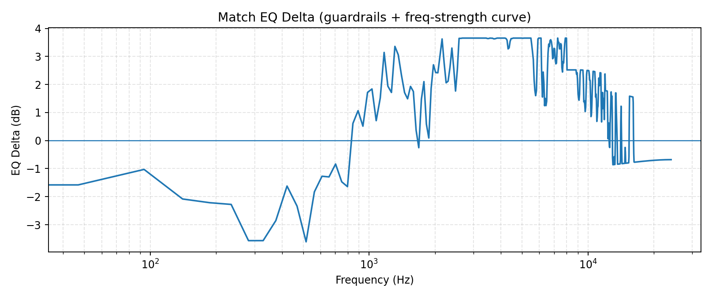
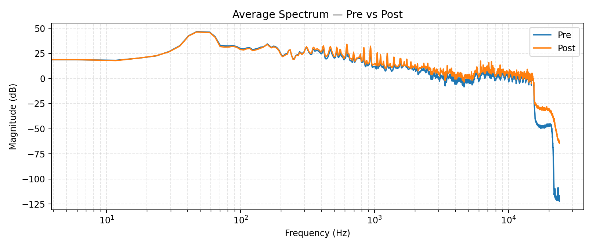

# Enhancement Report - AuralMind Maestro v7.2 HiFi

## Match EQ Delta Curve



## Spectrum Overlay



## Debug JSON

```json
{
  "version": "v7.3-hifi",
  "paths": {
    "reference": "C:\\Users\\goku\\Downloads\\Lil Durk - Turn Up A Notch (Official Video).mp3",
    "target": "C:\\Users\\goku\\LLM_uncensored\\Scripts\\Mastered\\test_tracks\\Goku.wav",
    "out": "C:\\Users\\goku\\LLM_uncensored\\Scripts\\Mastered\\batch_v7_3\\Goku_balanced_v7_v7.3-hifi.wav"
  },
  "stems": {
    "enabled": true,
    "model": "htdemucs",
    "device": "cpu",
    "model_sr": 44100,
    "split": true,
    "overlap": 0.25,
    "stems": [
      "drums",
      "bass",
      "other",
      "vocals"
    ]
  },
  "stem_block": {
    "enabled": true,
    "vocals_deess": {
      "enabled": true,
      "band_low": 6000.0,
      "band_high": 10000.0,
      "threshold_db": -22.0,
      "ratio": 2.0,
      "min_gain_db": -2.728900648766146
    },
    "key_glow": {
      "enabled": true,
      "other": {
        "enabled": true,
        "key": "A# minor",
        "glow_gain_db": 0.8,
        "glow_q": 1.2,
        "mix": 0.45,
        "bands": [
          {
            "f0": 155.56349186104046,
            "q": 1.2,
            "gain_db": 0.6000000000000001
          },
          {
            "f0": 174.61411571650194,
            "q": 1.2,
            "gain_db": 0.6000000000000001
          },
          {
            "f0": 184.9972113558172,
            "q": 1.2,
            "gain_db": 0.6000000000000001
          },
          {
            "f0": 207.65234878997256,
            "q": 1.2,
            "gain_db": 0.6006121879031978
          },
          {
            "f0": 233.08188075904496,
            "q": 1.2,
            "gain_db": 0.6026465504607237
          },
          {
            "f0": 261.6255653005986,
            "q": 1.2,
            "gain_db": 0.6049300452240479
          },
          {
            "f0": 277.1826309768721,
            "q": 1.2,
            "gain_db": 0.6061746104781498
          },
          {
            "f0": 311.1269837220809,
            "q": 1.2,
            "gain_db": 0.6088901586977665
          },
          {
            "f0": 349.2282314330039,
            "q": 1.2,
            "gain_db": 0.6119382585146403
          },
          {
            "f0": 369.9944227116344,
            "q": 1.2,
            "gain_db": 0.6135995538169308
          },
          {
            "f0": 415.3046975799451,
            "q": 1.2,
            "gain_db": 0.6172243758063957
          },
          {
            "f0": 466.1637615180899,
            "q": 1.2,
            "gain_db": 0.6212931009214473
          },
          {
            "f0": 523.2511306011972,
            "q": 1.2,
            "gain_db": 0.6258600904480959
          },
          {
            "f0": 554.3652619537442,
            "q": 1.2,
            "gain_db": 0.6283492209562995
          },
          {
            "f0": 622.2539674441618,
            "q": 1.2,
            "gain_db": 0.633780317395533
          },
          {
            "f0": 698.4564628660078,
            "q": 1.2,
            "gain_db": 0.6398765170292807
          },
          {
            "f0": 739.9888454232688,
            "q": 1.2,
            "gain_db": 0.6431991076338616
          },
          {
            "f0": 830.6093951598903,
            "q": 1.2,
            "gain_db": 0.6504487516127913
          }
        ]
      },
      "vocals": {
        "enabled": true,
        "key": "A# minor",
        "glow_gain_db": 0.8,
        "glow_q": 1.2,
        "mix": 0.45,
        "bands": [
          {
            "f0": 155.56349186104046,
            "q": 1.2,
            "gain_db": 0.6000000000000001
          },
          {
            "f0": 174.61411571650194,
            "q": 1.2,
            "gain_db": 0.6000000000000001
          },
          {
            "f0": 184.9972113558172,
            "q": 1.2,
            "gain_db": 0.6000000000000001
          },
          {
            "f0": 207.65234878997256,
            "q": 1.2,
            "gain_db": 0.6006121879031978
          },
          {
            "f0": 233.08188075904496,
            "q": 1.2,
            "gain_db": 0.6026465504607237
          },
          {
            "f0": 261.6255653005986,
            "q": 1.2,
            "gain_db": 0.6049300452240479
          },
          {
            "f0": 277.1826309768721,
            "q": 1.2,
            "gain_db": 0.6061746104781498
          },
          {
            "f0": 311.1269837220809,
            "q": 1.2,
            "gain_db": 0.6088901586977665
          },
          {
            "f0": 349.2282314330039,
            "q": 1.2,
            "gain_db": 0.6119382585146403
          },
          {
            "f0": 369.9944227116344,
            "q": 1.2,
            "gain_db": 0.6135995538169308
          },
          {
            "f0": 415.3046975799451,
            "q": 1.2,
            "gain_db": 0.6172243758063957
          },
          {
            "f0": 466.1637615180899,
            "q": 1.2,
            "gain_db": 0.6212931009214473
          },
          {
            "f0": 523.2511306011972,
            "q": 1.2,
            "gain_db": 0.6258600904480959
          },
          {
            "f0": 554.3652619537442,
            "q": 1.2,
            "gain_db": 0.6283492209562995
          },
          {
            "f0": 622.2539674441618,
            "q": 1.2,
            "gain_db": 0.633780317395533
          },
          {
            "f0": 698.4564628660078,
            "q": 1.2,
            "gain_db": 0.6398765170292807
          },
          {
            "f0": 739.9888454232688,
            "q": 1.2,
            "gain_db": 0.6431991076338616
          },
          {
            "f0": 830.6093951598903,
            "q": 1.2,
            "gain_db": 0.6504487516127913
          }
        ]
      }
    },
    "scale_shimmer": {
      "enabled": false
    },
    "snare_detect": {
      "enabled": true,
      "count": 800,
      "band_low": 1300.0,
      "band_high": 5200.0,
      "hop": 256
    }
  },
  "match_eq": {
    "enabled": true,
    "numtaps": 4097,
    "max_gain_db": 5.8,
    "smooth_hz": 95.0,
    "eq_phase": "minimum",
    "minphase_nfft": 16384,
    "match_strength": 0.63,
    "match_lo_hz": 120.0,
    "match_hi_hz": 9000.0,
    "match_lo_factor": 0.72,
    "match_hi_factor": 0.72,
    "guardrails": true,
    "eq_curve": {
      "freqs_hz": [
        0.0,
        46.875,
        93.75,
        140.625,
        187.5,
        234.375,
        281.25,
        328.125,
        375.0,
        421.875,
        468.75,
        515.625,
        562.5,
        609.375,
        656.25,
        703.125,
        750.0,
        796.875,
        843.75,
        890.625,
        937.5,
        984.375,
        1031.25,
        1078.125,
        1125.0,
        1171.875,
        1218.75,
        1265.625,
        1312.5,
        1359.375,
        1406.25,
        1453.125,
        1500.0,
        1546.875,
        1593.75,
        1640.625,
        1687.5,
        1734.375,
        1781.25,
        1828.125,
        1875.0,
        1921.875,
        1968.75,
        2015.625,
        2062.5,
        2109.375,
        2156.25,
        2203.125,
        2250.0,
        2296.875,
        2343.75,
        2390.625,
        2437.5,
        2484.375,
        2531.25,
        2578.125,
        2625.0,
        2671.875,
        2718.75,
        2765.625,
        2812.5,
        2859.375,
        2906.25,
        2953.125,
        3005.859375,
        3052.734375,
        3099.609375,
        3146.484375,
        3193.359375,
        3240.234375,
        3287.109375,
        3333.984375,
        3380.859375,
        3427.734375,
        3474.609375,
        3521.484375,
        3568.359375,
        3615.234375,
        3662.109375,
        3708.984375,
        3755.859375,
        3802.734375,
        3849.609375,
        3896.484375,
        3943.359375,
        3990.234375,
        4037.109375,
        4083.984375,
        4130.859375,
        4177.734375,
        4224.609375,
        4271.484375,
        4318.359375,
        4365.234375,
        4412.109375,
        4458.984375,
        4505.859375,
        4552.734375,
        4599.609375,
        4646.484375,
        4693.359375,
        4740.234375,
        4787.109375,
        4833.984375,
        4880.859375,
        4927.734375,
        4974.609375,
        5021.484375,
        5068.359375,
        5115.234375,
        5162.109375,
        5208.984375,
        5255.859375,
        5302.734375,
        5349.609375,
        5396.484375,
        5443.359375,
        5490.234375,
        5537.109375,
        5583.984375,
        5630.859375,
        5677.734375,
        5724.609375,
        5771.484375,
        5818.359375,
        5865.234375,
        5912.109375,
        5958.984375,
        6011.71875,
        6058.59375,
        6105.46875,
        6152.34375,
        6199.21875,
        6246.09375,
        6292.96875,
        6339.84375,
        6386.71875,
        6433.59375,
        6480.46875,
        6527.34375,
        6574.21875,
        6621.09375,
        6667.96875,
        6714.84375,
        6761.71875,
        6808.59375,
        6855.46875,
        6902.34375,
        6949.21875,
        6996.09375,
        7042.96875,
        7089.84375,
        7136.71875,
        7183.59375,
        7230.46875,
        7277.34375,
        7324.21875,
        7371.09375,
        7417.96875,
        7464.84375,
        7511.71875,
        7558.59375,
        7605.46875,
        7652.34375,
        7699.21875,
        7746.09375,
        7792.96875,
        7839.84375,
        7886.71875,
        7933.59375,
        7980.46875,
        8027.34375,
        8074.21875,
        8121.09375,
        8167.96875,
        8214.84375,
        8261.71875,
        8308.59375,
        8355.46875,
        8402.34375,
        8449.21875,
        8496.09375,
        8542.96875,
        8589.84375,
        8636.71875,
        8683.59375,
        8730.46875,
        8777.34375,
        8824.21875,
        8871.09375,
        8917.96875,
        8964.84375,
        9017.578125,
        9064.453125,
        9111.328125,
        9158.203125,
        9205.078125,
        9251.953125,
        9298.828125,
        9345.703125,
        9392.578125,
        9439.453125,
        9486.328125,
        9533.203125,
        9580.078125,
        9626.953125,
        9673.828125,
        9720.703125,
        9767.578125,
        9814.453125,
        9861.328125,
        9908.203125,
        9955.078125,
        10001.953125,
        10048.828125,
        10095.703125,
        10142.578125,
        10189.453125,
        10236.328125,
        10283.203125,
        10330.078125,
        10376.953125,
        10423.828125,
        10470.703125,
        10517.578125,
        10564.453125,
        10611.328125,
        10658.203125,
        10705.078125,
        10751.953125,
        10798.828125,
        10845.703125,
        10892.578125,
        10939.453125,
        10986.328125,
        11033.203125,
        11080.078125,
        11126.953125,
        11173.828125,
        11220.703125,
        11267.578125,
        11314.453125,
        11361.328125,
        11408.203125,
        11455.078125,
        11501.953125,
        11548.828125,
        11595.703125,
        11642.578125,
        11689.453125,
        11736.328125,
        11783.203125,
        11830.078125,
        11876.953125,
        11923.828125,
        11970.703125,
        12023.4375,
        12070.3125,
        12117.1875,
        12164.0625,
        12210.9375,
        12257.8125,
        12304.6875,
        12351.5625,
        12398.4375,
        12445.3125,
        12492.1875,
        12539.0625,
        12585.9375,
        12632.8125,
        12679.6875,
        12726.5625,
        12773.4375,
        12820.3125,
        12867.1875,
        12914.0625,
        12960.9375,
        13007.8125,
        13054.6875,
        13101.5625,
        13148.4375,
        13195.3125,
        13242.1875,
        13289.0625,
        13335.9375,
        13382.8125,
        13429.6875,
        13476.5625,
        13523.4375,
        13570.3125,
        13617.1875,
        13664.0625,
        13710.9375,
        13757.8125,
        13804.6875,
        13851.5625,
        13898.4375,
        13945.3125,
        13992.1875,
        14039.0625,
        14085.9375,
        14132.8125,
        14179.6875,
        14226.5625,
        14273.4375,
        14320.3125,
        14367.1875,
        14414.0625,
        14460.9375,
        14507.8125,
        14554.6875,
        14601.5625,
        14648.4375,
        14695.3125,
        14742.1875,
        14789.0625,
        14835.9375,
        14882.8125,
        14929.6875,
        14976.5625,
        15029.296875,
        15076.171875,
        15123.046875,
        15169.921875,
        15216.796875,
        15263.671875,
        15310.546875,
        15357.421875,
        15404.296875,
        15451.171875,
        15498.046875,
        15544.921875,
        15591.796875,
        15638.671875,
        15685.546875,
        15732.421875,
        15779.296875,
        15826.171875,
        15873.046875,
        15919.921875,
        15966.796875,
        16013.671875,
        16060.546875,
        16107.421875,
        16154.296875,
        16201.171875,
        16248.046875,
        16294.921875,
        16341.796875,
        16388.671875,
        16435.546875,
        16482.421875,
        16529.296875,
        16576.171875,
        16623.046875,
        16669.921875,
        16716.796875,
        16763.671875,
        16810.546875,
        16857.421875,
        16904.296875,
        16951.171875,
        16998.046875,
        17044.921875,
        17091.796875,
        17138.671875,
        17185.546875,
        17232.421875,
        17279.296875,
        17326.171875,
        17373.046875,
        17419.921875,
        17466.796875,
        17513.671875,
        17560.546875,
        17607.421875,
        17654.296875,
        17701.171875,
        17748.046875,
        17794.921875,
        17841.796875,
        17888.671875,
        17935.546875,
        17982.421875,
        18035.15625,
        18082.03125,
        18128.90625,
        18175.78125,
        18222.65625,
        18269.53125,
        18316.40625,
        18363.28125,
        18410.15625,
        18457.03125,
        18503.90625,
        18550.78125,
        18597.65625,
        18644.53125,
        18691.40625,
        18738.28125,
        18785.15625,
        18832.03125,
        18878.90625,
        18925.78125,
        18972.65625,
        19019.53125,
        19066.40625,
        19113.28125,
        19160.15625,
        19207.03125,
        19253.90625,
        19300.78125,
        19347.65625,
        19394.53125,
        19441.40625,
        19488.28125,
        19535.15625,
        19582.03125,
        19628.90625,
        19675.78125,
        19722.65625,
        19769.53125,
        19816.40625,
        19863.28125,
        19910.15625,
        19957.03125,
        20003.90625,
        20050.78125,
        20097.65625,
        20144.53125,
        20191.40625,
        20238.28125,
        20285.15625,
        20332.03125,
        20378.90625,
        20425.78125,
        20472.65625,
        20519.53125,
        20566.40625,
        20613.28125,
        20660.15625,
        20707.03125,
        20753.90625,
        20800.78125,
        20847.65625,
        20894.53125,
        20941.40625,
        20988.28125,
        21041.015625,
        21087.890625,
        21134.765625,
        21181.640625,
        21228.515625,
        21275.390625,
        21322.265625,
        21369.140625,
        21416.015625,
        21462.890625,
        21509.765625,
        21556.640625,
        21603.515625,
        21650.390625,
        21697.265625,
        21744.140625,
        21791.015625,
        21837.890625,
        21884.765625,
        21931.640625,
        21978.515625,
        22025.390625,
        22072.265625,
        22119.140625,
        22166.015625,
        22212.890625,
        22259.765625,
        22306.640625,
        22353.515625,
        22400.390625,
        22447.265625,
        22494.140625,
        22541.015625,
        22587.890625,
        22634.765625,
        22681.640625,
        22728.515625,
        22775.390625,
        22822.265625,
        22869.140625,
        22916.015625,
        22962.890625,
        23009.765625,
        23056.640625,
        23103.515625,
        23150.390625,
        23197.265625,
        23244.140625,
        23291.015625,
        23337.890625,
        23384.765625,
        23431.640625,
        23478.515625,
        23525.390625,
        23572.265625,
        23619.140625,
        23666.015625,
        23712.890625,
        23759.765625,
        23806.640625,
        23853.515625,
        23900.390625,
        23947.265625,
        24000.0
      ],
      "delta_db": [
        -1.36080002784729,
        -1.5808324813842773,
        -1.0288772583007812,
        -2.083172082901001,
        -2.216327667236328,
        -2.2765395641326904,
        -3.568549394607544,
        -3.568131923675537,
        -2.8532299995422363,
        -1.6216357946395874,
        -2.336538076400757,
        -3.6100399494171143,
        -1.8290985822677612,
        -1.2723201513290405,
        -1.2951786518096924,
        -0.8366086483001709,
        -1.4702284336090088,
        -1.643190860748291,
        0.6109740138053894,
        1.0650608539581299,
        0.5133320689201355,
        1.718670129776001,
        1.8403291702270508,
        0.7100719213485718,
        1.518357753753662,
        3.14223575592041,
        1.9413747787475586,
        1.7150990962982178,
        3.3577804565429688,
        3.060554027557373,
        2.330827236175537,
        1.7105040550231934,
        1.4891207218170166,
        1.9313769340515137,
        1.7501214742660522,
        0.36989203095436096,
        -0.25411152839660645,
        1.4719126224517822,
        2.1019718647003174,
        0.5868748426437378,
        0.09181832522153854,
        1.8635269403457642,
        2.702303647994995,
        2.424124002456665,
        2.417056083679199,
        3.0252301692962646,
        3.622481107711792,
        2.771378755569458,
        2.059753179550171,
        2.1174449920654297,
        2.617748260498047,
        3.2986817359924316,
        2.5779054164886475,
        1.7664389610290527,
        2.524571180343628,
        3.64432692527771,
        3.64432692527771,
        3.6540000438690186,
        3.6540000438690186,
        3.6540000438690186,
        3.6540000438690186,
        3.6540000438690186,
        3.6540000438690186,
        3.6540000438690186,
        3.6540000438690186,
        3.6540000438690186,
        3.6540000438690186,
        3.6540000438690186,
        3.6540000438690186,
        3.6540000438690186,
        3.6540000438690186,
        3.6540000438690186,
        3.6540000438690186,
        3.6540000438690186,
        3.6387460231781006,
        3.6387460231781006,
        3.6540000438690186,
        3.6499295234680176,
        3.6499295234680176,
        3.6285922527313232,
        3.6285922527313232,
        3.641730785369873,
        3.6540000438690186,
        3.6540000438690186,
        3.6540000438690186,
        3.6540000438690186,
        3.6540000438690186,
        3.6540000438690186,
        3.6540000438690186,
        3.6540000438690186,
        3.6394219398498535,
        3.5804765224456787,
        3.269130229949951,
        3.3064517974853516,
        3.5409023761749268,
        3.6374266147613525,
        3.6374266147613525,
        3.6540000438690186,
        3.6540000438690186,
        3.6540000438690186,
        3.6540000438690186,
        3.6540000438690186,
        3.6540000438690186,
        3.6540000438690186,
        3.6540000438690186,
        3.6540000438690186,
        3.6540000438690186,
        3.6504881381988525,
        3.6504881381988525,
        3.6540000438690186,
        3.6540000438690186,
        3.6540000438690186,
        3.6540000438690186,
        3.6540000438690186,
        3.6540000438690186,
        3.6540000438690186,
        3.6540000438690186,
        3.6540000438690186,
        3.414609670639038,
        3.1593480110168457,
        2.8880012035369873,
        2.174211263656616,
        1.7829933166503906,
        1.6013985872268677,
        1.7806059122085571,
        2.87536358833313,
        3.6224889755249023,
        3.6540000438690186,
        3.6540000438690186,
        3.6540000438690186,
        3.6540000438690186,
        2.2477331161499023,
        1.5522148609161377,
        2.443025588989258,
        2.0730600357055664,
        1.2432243824005127,
        1.502144694328308,
        1.245411992073059,
        1.3989665508270264,
        2.41742205619812,
        3.123382091522217,
        3.4403879642486572,
        3.3514657020568848,
        3.5638506412506104,
        3.5958240032196045,
        3.5327348709106445,
        3.3662075996398926,
        2.918375253677368,
        2.9545528888702393,
        3.286635398864746,
        3.2773077487945557,
        2.918816566467285,
        2.7355542182922363,
        2.7582623958587646,
        3.2486162185668945,
        3.6540000438690186,
        3.5015313625335693,
        3.5015313625335693,
        3.270848274230957,
        3.270848274230957,
        3.4571776390075684,
        3.4123473167419434,
        2.6062777042388916,
        2.444272041320801,
        2.8181493282318115,
        2.7650279998779297,
        3.173978567123413,
        3.470120668411255,
        3.6540000438690186,
        3.6540000438690186,
        3.6540000438690186,
        2.5199999809265137,
        2.5199999809265137,
        2.5199999809265137,
        2.5199999809265137,
        2.5199999809265137,
        2.5199999809265137,
        2.5199999809265137,
        2.5199999809265137,
        2.5199999809265137,
        2.5199999809265137,
        2.5199999809265137,
        2.5199999809265137,
        2.5199999809265137,
        2.5199999809265137,
        2.5199999809265137,
        2.5199999809265137,
        2.5199999809265137,
        2.5199999809265137,
        2.364502429962158,
        2.42453670501709,
        2.164741277694702,
        1.6584680080413818,
        1.497841715812683,
        1.4390584230422974,
        1.6536520719528198,
        2.333160161972046,
        2.5183541774749756,
        2.517704486846924,
        2.516954183578491,
        2.5161054134368896,
        2.5151612758636475,
        2.5141239166259766,
        2.2105917930603027,
        1.380926251411438,
        1.4264990091323853,
        1.2905086278915405,
        1.0357635021209717,
        1.1903868913650513,
        1.7592262029647827,
        2.3635966777801514,
        2.5009920597076416,
        2.4991517066955566,
        2.4972426891326904,
        2.495266914367676,
        2.4932262897491455,
        2.37701153755188,
        2.1493139266967773,
        2.1468749046325684,
        1.5432356595993042,
        0.8551236391067505,
        0.9242678880691528,
        1.25201416015625,
        1.8065751791000366,
        2.124619245529175,
        2.469637632369995,
        2.466996192932129,
        2.4643096923828125,
        2.4615797996520996,
        2.4588067531585693,
        2.133488893508911,
        1.549608826637268,
        1.6605697870254517,
        1.4123485088348389,
        0.6830362677574158,
        0.8325206637382507,
        1.167151927947998,
        1.2355562448501587,
        1.8817805051803589,
        2.229726552963257,
        1.9568803310394287,
        1.9717780351638794,
        2.4194705486297607,
        2.416232109069824,
        2.412968873977661,
        1.356629490852356,
        0.6654582619667053,
        1.3520811796188354,
        1.715184211730957,
        1.7060620784759521,
        1.1375561952590942,
        1.2675622701644897,
        1.5057260990142822,
        0.748640775680542,
        1.3856467008590698,
        2.3756864070892334,
        1.7788164615631104,
        1.7761852741241455,
        1.773544192314148,
        1.7708938121795654,
        1.7682344913482666,
        1.7655673027038574,
        1.0315347909927368,
        0.06690192222595215,
        0.5785769820213318,
        0.6304425001144409,
        0.06444548070430756,
        -0.22947590053081512,
        -0.24806521832942963,
        0.5950552225112915,
        0.9373382925987244,
        1.4269459247589111,
        1.7358280420303345,
        1.3853917121887207,
        1.5889954566955566,
        1.0777487754821777,
        -0.6138893365859985,
        -0.861083984375,
        -0.8597158193588257,
        -0.8583475351333618,
        -0.8569791913032532,
        -0.5725566744804382,
        -0.8542431592941284,
        -0.852875828742981,
        -0.1278158575296402,
        1.70028555393219,
        1.6975550651550293,
        1.146117091178894,
        0.7490922808647156,
        0.32811474800109863,
        -0.08901438862085342,
        -0.8419706225395203,
        -0.840613842010498,
        -0.839259147644043,
        -0.8379065990447998,
        -0.836556077003479,
        -0.8352077007293701,
        -0.8338620662689209,
        -0.8325185179710388,
        -0.8311779499053955,
        -0.6950314044952393,
        0.6482771635055542,
        1.2244919538497925,
        0.36865073442459106,
        -0.3652866780757904,
        -0.8231953382492065,
        -0.8218764066696167,
        -0.8205605745315552,
        -0.819248378276825,
        -0.8179402351379395,
        -0.8166355490684509,
        -0.8153345584869385,
        -0.8140377998352051,
        -0.8127450942993164,
        -0.8114563822746277,
        -0.24474051594734192,
        -0.4199802279472351,
        -0.8076157569885254,
        -0.8063443899154663,
        -0.8050774335861206,
        -0.8036574125289917,
        -0.8024002313613892,
        -0.8011479377746582,
        -0.7999002933502197,
        -0.7986575961112976,
        -0.7974197864532471,
        -0.7961871027946472,
        -0.7949591875076294,
        -0.5771084427833557,
        0.7415950894355774,
        1.5826139450073242,
        1.5801998376846313,
        1.577797293663025,
        1.575404405593872,
        1.5730233192443848,
        1.570652961730957,
        1.5682933330535889,
        1.5659455060958862,
        1.5636086463928223,
        1.5612833499908447,
        1.5589690208435059,
        1.5566672086715698,
        1.554376244544983,
        1.3601504564285278,
        0.21305078268051147,
        -0.4640401005744934,
        -0.7614623308181763,
        -0.7715504169464111,
        -0.7704411149024963,
        -0.7693378329277039,
        -0.7682405710220337,
        -0.7671495676040649,
        -0.7660648226737976,
        -0.7649862170219421,
        -0.7639139890670776,
        -0.7628479599952698,
        -0.7617883086204529,
        -0.760735034942627,
        -0.7596882581710815,
        -0.7586475610733032,
        -0.7576137185096741,
        -0.7565863132476807,
        -0.7555651664733887,
        -0.7545506358146667,
        -0.7535428404808044,
        -0.7525414228439331,
        -0.7515468597412109,
        -0.750558614730835,
        -0.7495772242546082,
        -0.7486022114753723,
        -0.7476341128349304,
        -0.7466727495193481,
        -0.7457180619239807,
        -0.7447699308395386,
        -0.7438288331031799,
        -0.7428943514823914,
        -0.7419666051864624,
        -0.7410458326339722,
        -0.7401317358016968,
        -0.7392245531082153,
        -0.7383241653442383,
        -0.7374306917190552,
        -0.7365440130233765,
        -0.7356643676757812,
        -0.7346829175949097,
        -0.7338178157806396,
        -0.732959508895874,
        -0.7321083545684814,
        -0.7312642335891724,
        -0.7304267287254333,
        -0.7295964360237122,
        -0.7287729382514954,
        -0.7279566526412964,
        -0.7271472215652466,
        -0.7263447046279907,
        -0.7255491614341736,
        -0.7247608304023743,
        -0.7239792346954346,
        -0.7232049107551575,
        -0.7224375009536743,
        -0.7216771245002747,
        -0.7209237813949585,
        -0.7201774716377258,
        -0.7194383144378662,
        -0.7187060713768005,
        -0.7179808616638184,
        -0.7172626852989197,
        -0.7165515422821045,
        -0.7158476114273071,
        -0.7151505351066589,
        -0.7144606709480286,
        -0.7137777805328369,
        -0.7131020426750183,
        -0.7124332189559937,
        -0.7117714881896973,
        -0.7111168503761292,
        -0.7104694247245789,
        -0.7098288536071777,
        -0.7091953754425049,
        -0.7085690498352051,
        -0.7079496383666992,
        -0.7073373794555664,
        -0.7067322731018066,
        -0.7061339616775513,
        -0.705543041229248,
        -0.7049587965011597,
        -0.7043817043304443,
        -0.7038118839263916,
        -0.7032488584518433,
        -0.7026929259300232,
        -0.7021440267562866,
        -0.7016021013259888,
        -0.701067328453064,
        -0.7005394101142883,
        -0.7000187039375305,
        -0.6995048522949219,
        -0.698997974395752,
        -0.6984983086585999,
        -0.6980054378509521,
        -0.6975196599960327,
        -0.6970407962799072,
        -0.6965688467025757,
        -0.6961040496826172,
        -0.6956461071968079,
        -0.695195198059082,
        -0.6947511434555054,
        -0.6943141222000122,
        -0.693884015083313,
        -0.6934083700180054,
        -0.6929929256439209,
        -0.6925845146179199,
        -0.6921830177307129,
        -0.6917881965637207,
        -0.6914005875587463,
        -0.691019594669342,
        -0.6906456351280212,
        -0.6902785897254944,
        -0.6899182796478271,
        -0.6895649433135986,
        -0.6892184019088745,
        -0.6888786554336548,
        -0.6885457634925842,
        -0.6882196664810181,
        -0.6879004240036011,
        -0.6875880360603333,
        -0.6872824430465698,
        -0.686983585357666,
        -0.6866915225982666,
        -0.6864062547683716,
        -0.686127781867981,
        -0.6858559846878052,
        -0.685590922832489,
        -0.6853326559066772,
        -0.6850810050964355,
        -0.6848361492156982,
        -0.6845980286598206,
        -0.6843664646148682,
        -0.6841416954994202,
        -0.6839236617088318,
        -0.6837121844291687,
        -0.6835073828697205,
        -0.6833092570304871,
        -0.6831177473068237,
        -0.6829327940940857,
        -0.6827545166015625,
        -0.6825828552246094,
        -0.6824177503585815,
        -0.6822592616081238,
        -0.6821072697639465,
        -0.6819618940353394,
        -0.6818230152130127,
        -0.6816907525062561,
        -0.6815649271011353,
        -0.6814457178115845,
        -0.6813329458236694,
        -0.6812266707420349,
        -0.6811268329620361,
        -0.6810335516929626,
        -0.6809467077255249,
        -0.6808663010597229,
        -0.6807923316955566,
        -0.6807247400283813,
        -0.6806636452674866,
        -0.680608868598938,
        -0.6805605888366699,
        -0.6805185675621033,
        -0.6804829835891724,
        -0.6804537773132324,
        -0.6804308295249939,
        -0.6804143190383911,
        -0.680404007434845,
        -0.680400013923645
      ]
    }
  },
  "perceptual": {
    "enabled": true,
    "pre": {
      "enabled": true,
      "mode": "erb",
      "n_bands": 24,
      "fast": true,
      "rmse_db": 4.909846902905236,
      "mae_db": 3.9962484784631083,
      "wrmse_db": 4.771166045867563,
      "score_0_100": 52.28833954132437,
      "band_centers_hz": [
        41.41544163465481,
        87.93250180957403,
        142.45640657163278,
        206.365350501519,
        281.274752754666,
        369.07808982873826,
        471.99475675514236,
        592.6261664964939,
        734.0215055681715,
        899.7548079813769,
        1094.0152956970494,
        1321.7132691160843,
        1588.6042241878129,
        1901.4343334308696,
        2268.1109681737807,
        2697.9025722866777,
        3201.672939589875,
        3792.1558167429057,
        4484.276772720197,
        5295.530470731788,
        6246.42287884878,
        7360.989597041554,
        8667.403402324744,
        10198.686368858924
      ],
      "band_ref_db": [
        9.809545209413937,
        12.456618619482416,
        5.424856230670191,
        6.887938187033672,
        -1.960990343151277,
        7.768898249844174,
        4.270120716084296,
        3.943652493939151,
        2.145944070633657,
        0.02904298910877401,
        0.3071442510467577,
        -0.33080005716961125,
        -1.3738730546381817,
        -0.7732006143169521,
        -0.21769316045821796,
        -0.9315509639713042,
        -0.627800510711058,
        -0.02904298910877401,
        -4.489285488558604,
        -2.1511070506888075,
        -0.06515145178180859,
        2.333063582842417,
        0.41071924318628206,
        -5.136670788832063
      ],
      "band_tgt_db": [
        14.411119267730498,
        11.815856607184472,
        7.653392725956564,
        9.767196806445114,
        8.242254998651063,
        15.2884952780393,
        11.564122038407689,
        10.438505649733209,
        5.6859416795866835,
        4.417898160060361,
        1.3369793952347315,
        -0.5195984644529048,
        0.1626573212755673,
        -0.7190471958876685,
        -1.947707169721479,
        -6.952146206107951,
        -10.296821735017478,
        -7.273331832539029,
        -9.233211914834172,
        -6.870708871583517,
        -1.8230699380160473,
        -0.16265732127556376,
        -2.750649428595601,
        -6.904180484359539
      ],
      "band_delta_db": [
        4.601574058316562,
        -0.6407620122979445,
        2.2285364952863738,
        2.8792586194114413,
        10.20324534180234,
        7.519597028195125,
        7.294001322323393,
        6.494853155794058,
        3.5399976089530263,
        4.388855170951587,
        1.0298351441879738,
        -0.18879840728329356,
        1.536530375913749,
        0.05415341842928356,
        -1.730014009263261,
        -6.020595242136647,
        -9.66902122430642,
        -7.244288843430255,
        -4.743926426275568,
        -4.7196018208947095,
        -1.7579184862342387,
        -2.495720904117981,
        -3.161368671781883,
        -1.767509695527476
      ],
      "lowmid_excess_db": 6.867366996469635,
      "presence_delta_db": -5.687907927717809,
      "air_delta_db": -2.4644391836546795,
      "presence_deficit_db": 5.687907927717809,
      "air_deficit_db": 2.4644391836546795
    },
    "guide": {
      "applied": true,
      "mix": 0.35,
      "cut_lowmid_db": 0.5249999999999999,
      "boost_presence_db": 0.42000000000000004,
      "boost_air_db": 0.26249999999999996,
      "bands": [
        [
          250.0,
          0.85,
          -0.5249999999999999
        ],
        [
          3500.0,
          0.95,
          0.42000000000000004
        ],
        [
          11000.0,
          0.8,
          0.26249999999999996
        ]
      ],
      "lowmid_excess_db": 6.867366996469635,
      "presence_deficit_db": 5.687907927717809,
      "air_deficit_db": 2.4644391836546795
    },
    "post": {
      "enabled": true,
      "mode": "erb",
      "n_bands": 24,
      "fast": true,
      "rmse_db": 3.9601903887990004,
      "mae_db": 3.1305659463080224,
      "wrmse_db": 3.8609068823166575,
      "score_0_100": 61.390931176833426,
      "band_centers_hz": [
        41.41544163465481,
        87.93250180957403,
        142.45640657163278,
        206.365350501519,
        281.274752754666,
        369.07808982873826,
        471.99475675514236,
        592.6261664964939,
        734.0215055681715,
        899.7548079813769,
        1094.0152956970494,
        1321.7132691160843,
        1588.6042241878129,
        1901.4343334308696,
        2268.1109681737807,
        2697.9025722866777,
        3201.672939589875,
        3792.1558167429057,
        4484.276772720197,
        5295.530470731788,
        6246.42287884878,
        7360.989597041554,
        8667.403402324744,
        10198.686368858924
      ],
      "band_ref_db": [
        9.809545209413937,
        12.456618619482416,
        5.424856230670191,
        6.887938187033672,
        -1.960990343151277,
        7.768898249844174,
        4.270120716084296,
        3.943652493939151,
        2.145944070633657,
        0.02904298910877401,
        0.3071442510467577,
        -0.33080005716961125,
        -1.3738730546381817,
        -0.7732006143169521,
        -0.21769316045821796,
        -0.9315509639713042,
        -0.627800510711058,
        -0.02904298910877401,
        -4.489285488558604,
        -2.1511070506888075,
        -0.06515145178180859,
        2.333063582842417,
        0.41071924318628206,
        -5.136670788832063
      ],
      "band_tgt_db": [
        15.068422498811579,
        11.870626017542143,
        7.392884964716167,
        8.355473257961137,
        6.27055409830929,
        13.192985044089163,
        9.896630198880068,
        8.821389043022258,
        4.377233849892669,
        3.345500426941708,
        0.4490046214766181,
        -1.209851361904061,
        -0.4490046214766181,
        -0.9852007682883581,
        -1.62113755538493,
        -6.01912550208333,
        -8.985365982214564,
        -6.108070234420232,
        -8.183727108773827,
        -5.976374375268929,
        -1.067502139939002,
        0.7019625976243447,
        -1.8302860832658432,
        -5.802637462463135
      ],
      "band_delta_db": [
        5.258877289397642,
        -0.5859926019402728,
        1.9680287340459763,
        1.4675350709274646,
        8.231544441460567,
        5.424086794244989,
        5.626509482795772,
        4.877736549083107,
        2.2312897792590114,
        3.316457437832934,
        0.14186037042986044,
        -0.8790513047344497,
        0.9248684331615635,
        -0.21200015397140604,
        -1.4034443949267121,
        -5.087574538112026,
        -8.357565471503506,
        -6.079027245311458,
        -3.6944416202152226,
        -3.825267324580121,
        -1.0023506881571933,
        -1.6311009852180725,
        -2.2410053264521252,
        -0.6659666736310719
      ],
      "lowmid_excess_db": 5.04105543554434,
      "presence_delta_db": -4.741220099108174,
      "air_delta_db": -1.4534860000415986,
      "presence_deficit_db": 4.741220099108174,
      "air_deficit_db": 1.4534860000415986
    }
  },
  "mono_sub": {
    "enabled": true,
    "cutoff_hz": 115.0,
    "mix": 0.78
  },
  "dynamic_sidechain": {
    "enabled": true,
    "sub_band_hz": [
      40.0,
      100.0
    ],
    "mud_band_hz": [
      200.0,
      400.0
    ],
    "threshold": 0.35,
    "max_cut_db": 2.5,
    "mean_cut_db": 0.33115154504776,
    "attack_ms": 6.0,
    "release_ms": 80.0
  },
  "transient_air": {
    "enabled": true,
    "air_hz": 11000.0,
    "target_gain_db": 2.0,
    "avg_gain_db": 1.803675889968872,
    "transient_sensitivity": 0.5,
    "attack_ms": 2.0,
    "release_ms": 60.0
  },
  "tilt_eq": {
    "enabled": true,
    "tilt_db_per_oct": 0.11,
    "pivot_hz": 1050.0,
    "max_tilt_db": 3.0,
    "guard_lo_hz": 35.0,
    "guard_hi_hz": 14000.0,
    "numtaps": 513
  },
  "spatial": {
    "enabled": true,
    "side_hp_hz": 180.0,
    "width_mid": 1.05,
    "width_hi": 1.25,
    "corr": 0.9562367181623961,
    "corr_min": 0.0
  },
  "movement": {
    "enabled": true,
    "amount": 0.1
  },
  "groove_glue": {
    "enabled": true,
    "mix": 0.1,
    "base_drive": 1.15,
    "dynamic": 0.18
  },
  "hooklift": {
    "enabled": false
  },
  "imd_guard": {
    "enabled": true,
    "split_hz": 160.0,
    "drive_db": 2.25,
    "mix": 0.85,
    "oversample": 4,
    "clip": {
      "drive_db": 2.25,
      "mix": 0.85,
      "oversample": 4
    }
  },
  "clarity_guard": {
    "enabled": true,
    "gr_scale": 1.0,
    "limit_gr_db": 0.06329396576639641,
    "tilt_slope_db_per_oct": -0.022359780790260655,
    "tilt_correction_db_per_oct": 0.013415868474156392,
    "lowmid_excess_db": 0.0,
    "presence_deficit_db": 2.351456880569458,
    "air_deficit_db": 2.3876826763153076,
    "bands": [
      [
        3500.0,
        0.95,
        0.51
      ],
      [
        11000.0,
        0.8,
        0.21
      ]
    ]
  },
  "post_clarity_limiter": {
    "enabled": true,
    "ceiling_dbfs": -1.0,
    "tp_oversample": 8,
    "min_gain_db": -0.49769662398520187,
    "true_peak_dbfs": -1.0000002900227403,
    "ceiling_chase_strength": 1.0
  },
  "post_clarity_limiter_tp_dbfs": -1.0000002900227403,
  "finalize": {
    "enabled": true,
    "target_lufs": -11.4,
    "final_lufs": -10.923043279373644,
    "gain_db_total": -2.8701032522263272,
    "target_peak_dbfs": -1.0,
    "final_true_peak_dbfs": -1.0000002900227403,
    "iters": 2,
    "limiter": {
      "enabled": true,
      "ceiling_dbfs": -1.0,
      "tp_oversample": 8,
      "min_gain_db": -0.31317859171416473,
      "true_peak_dbfs": -1.0000002900227403,
      "ceiling_chase_strength": 1.0
    }
  },
  "transient_restore": {
    "enabled": true,
    "restore_db": 1.05,
    "band_low": 1500.0,
    "band_high": 6500.0,
    "attack_ms": 1.4,
    "decay_ms": 38.0,
    "mix": 0.55,
    "transients": 800,
    "post_tp_limiter": {
      "enabled": true,
      "ceiling_dbfs": -1.0,
      "tp_oversample": 8,
      "min_gain_db": -0.06329396576639641,
      "true_peak_dbfs": -0.9999997091320568,
      "ceiling_chase_strength": 1.0
    }
  },
  "pre": {
    "lufs": -11.127303621380682,
    "translation": {
      "rms_db": -12.035682616053451,
      "peak_dbfs": 0.08479616815758323,
      "crest_db": 12.120478784211034,
      "tilt_db_per_oct": -5.9466666305593865,
      "lowmid_db": 21.63235855102539,
      "presence_db": -6.40578031539917,
      "air_db": -5.771923065185547,
      "lowmid_minus_presence_db": 28.03813886642456
    },
    "true_peak_dbfs": 0.11859859155992586,
    "peak_dbfs": 0.08479616815758323
  },
  "post": {
    "lufs": -10.887447139454135,
    "translation": {
      "rms_db": -12.002505084523328,
      "peak_dbfs": -1.0065528845881788,
      "crest_db": 10.99595219993515,
      "tilt_db_per_oct": -5.303073687997214,
      "lowmid_db": 22.249610900878906,
      "presence_db": -1.8999946117401123,
      "air_db": -2.8767595291137695,
      "lowmid_minus_presence_db": 24.14960551261902
    },
    "true_peak_dbfs": -1.0000002900227403,
    "peak_dbfs": -1.0065528845881788
  },
  "plots": {
    "eq_delta": "Goku_balanced_v7_v7.3-hifi_Report_EQ_Delta.png",
    "spectrum_overlay": "Goku_balanced_v7_v7.3-hifi_Report_Spectrum_Overlay.png"
  }
}
```