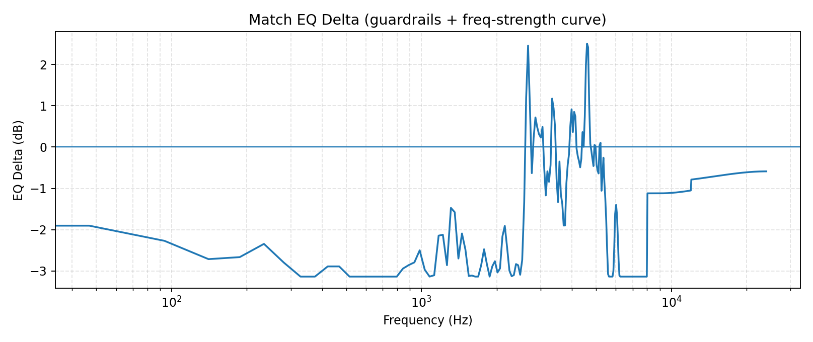
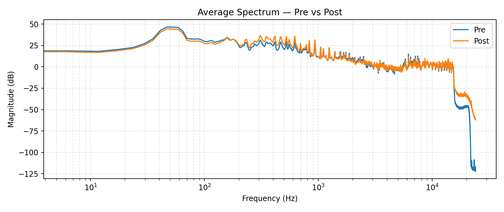
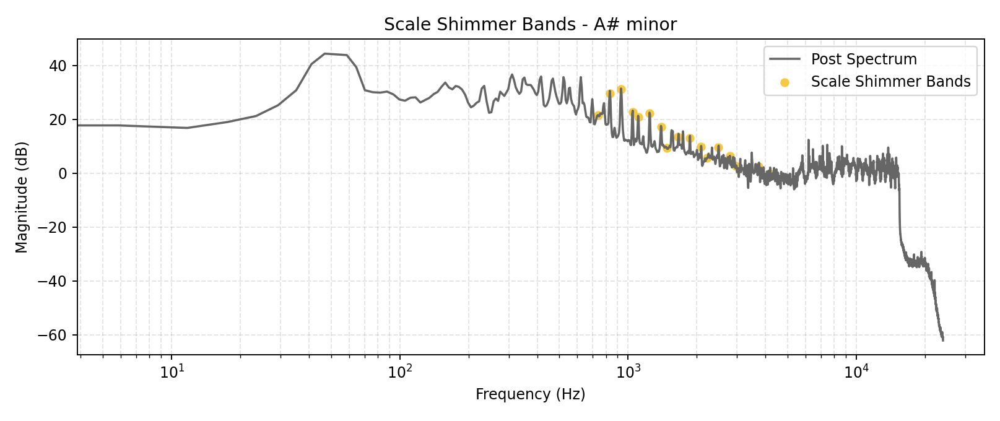

# Enhancement Report - AuralMind Maestro v7.1

## Match EQ Delta Curve



## Spectrum Overlay



## Scale Shimmer Bands



## Debug JSON

```json
{
  "version": "v7.1",
  "paths": {
    "reference": "C:\\Users\\goku\\Downloads\\Brent Faiyaz - Pistachios [Official Video].mp3",
    "target": "C:\\Users\\goku\\LLM_uncensored\\Scripts\\Mastered\\test_tracks\\Goku.wav",
    "out": "C:\\Users\\goku\\LLM_uncensored\\Scripts\\Mastered\\test_tracks_mastered\\Goku_innovative_trap_v7.1.wav"
  },
  "stems": {
    "enabled": true,
    "model": "htdemucs",
    "device": "cpu",
    "model_sr": 44100,
    "split": true,
    "overlap": 0.25,
    "stems": [
      "drums",
      "bass",
      "other",
      "vocals"
    ]
  },
  "stem_block": {
    "enabled": true,
    "vocals_deess": {
      "enabled": true,
      "band_low": 6000.0,
      "band_high": 10000.0,
      "threshold_db": -22.0,
      "ratio": 2.0,
      "min_gain_db": -2.6427210200048417
    },
    "key_glow": {
      "enabled": true,
      "other": {
        "enabled": true,
        "key": "A# minor",
        "glow_gain_db": 1.0,
        "glow_q": 1.2,
        "mix": 0.55,
        "bands": [
          {
            "f0": 155.56349186104046,
            "q": 1.2,
            "gain_db": 0.75
          },
          {
            "f0": 174.61411571650194,
            "q": 1.2,
            "gain_db": 0.75
          },
          {
            "f0": 184.9972113558172,
            "q": 1.2,
            "gain_db": 0.75
          },
          {
            "f0": 207.65234878997256,
            "q": 1.2,
            "gain_db": 0.7507652348789973
          },
          {
            "f0": 233.08188075904496,
            "q": 1.2,
            "gain_db": 0.7533081880759045
          },
          {
            "f0": 261.6255653005986,
            "q": 1.2,
            "gain_db": 0.7561625565300598
          },
          {
            "f0": 277.1826309768721,
            "q": 1.2,
            "gain_db": 0.7577182630976872
          },
          {
            "f0": 311.1269837220809,
            "q": 1.2,
            "gain_db": 0.7611126983722081
          },
          {
            "f0": 349.2282314330039,
            "q": 1.2,
            "gain_db": 0.7649228231433004
          },
          {
            "f0": 369.9944227116344,
            "q": 1.2,
            "gain_db": 0.7669994422711635
          },
          {
            "f0": 415.3046975799451,
            "q": 1.2,
            "gain_db": 0.7715304697579946
          },
          {
            "f0": 466.1637615180899,
            "q": 1.2,
            "gain_db": 0.776616376151809
          },
          {
            "f0": 523.2511306011972,
            "q": 1.2,
            "gain_db": 0.7823251130601198
          },
          {
            "f0": 554.3652619537442,
            "q": 1.2,
            "gain_db": 0.7854365261953744
          },
          {
            "f0": 622.2539674441618,
            "q": 1.2,
            "gain_db": 0.7922253967444162
          },
          {
            "f0": 698.4564628660078,
            "q": 1.2,
            "gain_db": 0.7998456462866008
          },
          {
            "f0": 739.9888454232688,
            "q": 1.2,
            "gain_db": 0.8039988845423269
          },
          {
            "f0": 830.6093951598903,
            "q": 1.2,
            "gain_db": 0.813060939515989
          }
        ]
      },
      "vocals": {
        "enabled": true,
        "key": "A# minor",
        "glow_gain_db": 1.0,
        "glow_q": 1.2,
        "mix": 0.55,
        "bands": [
          {
            "f0": 155.56349186104046,
            "q": 1.2,
            "gain_db": 0.75
          },
          {
            "f0": 174.61411571650194,
            "q": 1.2,
            "gain_db": 0.75
          },
          {
            "f0": 184.9972113558172,
            "q": 1.2,
            "gain_db": 0.75
          },
          {
            "f0": 207.65234878997256,
            "q": 1.2,
            "gain_db": 0.7507652348789973
          },
          {
            "f0": 233.08188075904496,
            "q": 1.2,
            "gain_db": 0.7533081880759045
          },
          {
            "f0": 261.6255653005986,
            "q": 1.2,
            "gain_db": 0.7561625565300598
          },
          {
            "f0": 277.1826309768721,
            "q": 1.2,
            "gain_db": 0.7577182630976872
          },
          {
            "f0": 311.1269837220809,
            "q": 1.2,
            "gain_db": 0.7611126983722081
          },
          {
            "f0": 349.2282314330039,
            "q": 1.2,
            "gain_db": 0.7649228231433004
          },
          {
            "f0": 369.9944227116344,
            "q": 1.2,
            "gain_db": 0.7669994422711635
          },
          {
            "f0": 415.3046975799451,
            "q": 1.2,
            "gain_db": 0.7715304697579946
          },
          {
            "f0": 466.1637615180899,
            "q": 1.2,
            "gain_db": 0.776616376151809
          },
          {
            "f0": 523.2511306011972,
            "q": 1.2,
            "gain_db": 0.7823251130601198
          },
          {
            "f0": 554.3652619537442,
            "q": 1.2,
            "gain_db": 0.7854365261953744
          },
          {
            "f0": 622.2539674441618,
            "q": 1.2,
            "gain_db": 0.7922253967444162
          },
          {
            "f0": 698.4564628660078,
            "q": 1.2,
            "gain_db": 0.7998456462866008
          },
          {
            "f0": 739.9888454232688,
            "q": 1.2,
            "gain_db": 0.8039988845423269
          },
          {
            "f0": 830.6093951598903,
            "q": 1.2,
            "gain_db": 0.813060939515989
          }
        ]
      }
    },
    "scale_shimmer": {
      "enabled": true,
      "other": {
        "enabled": true,
        "key": "A# minor",
        "tonic": "A#",
        "mode": "minor",
        "drive": 1.55,
        "mix": 0.04,
        "band_gain_db": 0.7,
        "q": 5.5,
        "bands_used": 18,
        "bands": [
          {
            "f0": 739.9888454232688,
            "q": 5.5,
            "gain_db": 0.5627992191796288
          },
          {
            "f0": 830.6093951598903,
            "q": 5.5,
            "gain_db": 0.5691426576611923
          },
          {
            "f0": 932.3275230361799,
            "q": 5.5,
            "gain_db": 0.5762629266125325
          },
          {
            "f0": 1046.5022612023945,
            "q": 5.5,
            "gain_db": 0.5842551582841675
          },
          {
            "f0": 1108.7305239074883,
            "q": 5.5,
            "gain_db": 0.5886111366735242
          },
          {
            "f0": 1244.5079348883237,
            "q": 5.5,
            "gain_db": 0.5981155554421826
          },
          {
            "f0": 1396.9129257320155,
            "q": 5.5,
            "gain_db": 0.608783904801241
          },
          {
            "f0": 1479.9776908465376,
            "q": 5.5,
            "gain_db": 0.6145984383592576
          },
          {
            "f0": 1661.2187903197805,
            "q": 5.5,
            "gain_db": 0.6272853153223846
          },
          {
            "f0": 1864.6550460723597,
            "q": 5.5,
            "gain_db": 0.6415258532250652
          },
          {
            "f0": 2093.004522404789,
            "q": 5.5,
            "gain_db": 0.6575103165683351
          },
          {
            "f0": 2217.4610478149766,
            "q": 5.5,
            "gain_db": 0.6662222733470483
          },
          {
            "f0": 2489.0158697766474,
            "q": 5.5,
            "gain_db": 0.6852311108843653
          },
          {
            "f0": 2793.825851464031,
            "q": 5.5,
            "gain_db": 0.7
          },
          {
            "f0": 2959.955381693075,
            "q": 5.5,
            "gain_db": 0.7
          },
          {
            "f0": 3322.437580639561,
            "q": 5.5,
            "gain_db": 0.7
          },
          {
            "f0": 3729.3100921447194,
            "q": 5.5,
            "gain_db": 0.7
          },
          {
            "f0": 4186.009044809578,
            "q": 5.5,
            "gain_db": 0.7
          }
        ]
      },
      "vocals": {
        "enabled": true,
        "key": "A# minor",
        "tonic": "A#",
        "mode": "minor",
        "drive": 1.55,
        "mix": 0.04,
        "band_gain_db": 0.7,
        "q": 5.5,
        "bands_used": 18,
        "bands": [
          {
            "f0": 739.9888454232688,
            "q": 5.5,
            "gain_db": 0.5627992191796288
          },
          {
            "f0": 830.6093951598903,
            "q": 5.5,
            "gain_db": 0.5691426576611923
          },
          {
            "f0": 932.3275230361799,
            "q": 5.5,
            "gain_db": 0.5762629266125325
          },
          {
            "f0": 1046.5022612023945,
            "q": 5.5,
            "gain_db": 0.5842551582841675
          },
          {
            "f0": 1108.7305239074883,
            "q": 5.5,
            "gain_db": 0.5886111366735242
          },
          {
            "f0": 1244.5079348883237,
            "q": 5.5,
            "gain_db": 0.5981155554421826
          },
          {
            "f0": 1396.9129257320155,
            "q": 5.5,
            "gain_db": 0.608783904801241
          },
          {
            "f0": 1479.9776908465376,
            "q": 5.5,
            "gain_db": 0.6145984383592576
          },
          {
            "f0": 1661.2187903197805,
            "q": 5.5,
            "gain_db": 0.6272853153223846
          },
          {
            "f0": 1864.6550460723597,
            "q": 5.5,
            "gain_db": 0.6415258532250652
          },
          {
            "f0": 2093.004522404789,
            "q": 5.5,
            "gain_db": 0.6575103165683351
          },
          {
            "f0": 2217.4610478149766,
            "q": 5.5,
            "gain_db": 0.6662222733470483
          },
          {
            "f0": 2489.0158697766474,
            "q": 5.5,
            "gain_db": 0.6852311108843653
          },
          {
            "f0": 2793.825851464031,
            "q": 5.5,
            "gain_db": 0.7
          },
          {
            "f0": 2959.955381693075,
            "q": 5.5,
            "gain_db": 0.7
          },
          {
            "f0": 3322.437580639561,
            "q": 5.5,
            "gain_db": 0.7
          },
          {
            "f0": 3729.3100921447194,
            "q": 5.5,
            "gain_db": 0.7
          },
          {
            "f0": 4186.009044809578,
            "q": 5.5,
            "gain_db": 0.7
          }
        ]
      }
    },
    "snare_detect": {
      "enabled": true,
      "count": 791,
      "band_low": 1300.0,
      "band_high": 5200.0,
      "hop": 256
    }
  },
  "match_eq": {
    "enabled": true,
    "numtaps": 4097,
    "max_gain_db": 5.6,
    "smooth_hz": 90.0,
    "eq_phase": "minimum",
    "minphase_nfft": 16384,
    "match_strength": 0.56,
    "match_lo_hz": 120.0,
    "match_hi_hz": 9000.0,
    "match_lo_factor": 0.72,
    "match_hi_factor": 0.7,
    "guardrails": true,
    "eq_curve": {
      "freqs_hz": [
        0.0,
        46.875,
        93.75,
        140.625,
        187.5,
        234.375,
        281.25,
        328.125,
        375.0,
        421.875,
        468.75,
        515.625,
        562.5,
        609.375,
        656.25,
        703.125,
        750.0,
        796.875,
        843.75,
        890.625,
        937.5,
        984.375,
        1031.25,
        1078.125,
        1125.0,
        1171.875,
        1218.75,
        1265.625,
        1312.5,
        1359.375,
        1406.25,
        1453.125,
        1500.0,
        1546.875,
        1593.75,
        1640.625,
        1687.5,
        1734.375,
        1781.25,
        1828.125,
        1875.0,
        1921.875,
        1968.75,
        2015.625,
        2062.5,
        2109.375,
        2156.25,
        2203.125,
        2250.0,
        2296.875,
        2343.75,
        2390.625,
        2437.5,
        2484.375,
        2531.25,
        2578.125,
        2625.0,
        2671.875,
        2718.75,
        2765.625,
        2812.5,
        2859.375,
        2906.25,
        2953.125,
        3005.859375,
        3052.734375,
        3099.609375,
        3146.484375,
        3193.359375,
        3240.234375,
        3287.109375,
        3333.984375,
        3380.859375,
        3427.734375,
        3474.609375,
        3521.484375,
        3568.359375,
        3615.234375,
        3662.109375,
        3708.984375,
        3755.859375,
        3802.734375,
        3849.609375,
        3896.484375,
        3943.359375,
        3990.234375,
        4037.109375,
        4083.984375,
        4130.859375,
        4177.734375,
        4224.609375,
        4271.484375,
        4318.359375,
        4365.234375,
        4412.109375,
        4458.984375,
        4505.859375,
        4552.734375,
        4599.609375,
        4646.484375,
        4693.359375,
        4740.234375,
        4787.109375,
        4833.984375,
        4880.859375,
        4927.734375,
        4974.609375,
        5021.484375,
        5068.359375,
        5115.234375,
        5162.109375,
        5208.984375,
        5255.859375,
        5302.734375,
        5349.609375,
        5396.484375,
        5443.359375,
        5490.234375,
        5537.109375,
        5583.984375,
        5630.859375,
        5677.734375,
        5724.609375,
        5771.484375,
        5818.359375,
        5865.234375,
        5912.109375,
        5958.984375,
        6011.71875,
        6058.59375,
        6105.46875,
        6152.34375,
        6199.21875,
        6246.09375,
        6292.96875,
        6339.84375,
        6386.71875,
        6433.59375,
        6480.46875,
        6527.34375,
        6574.21875,
        6621.09375,
        6667.96875,
        6714.84375,
        6761.71875,
        6808.59375,
        6855.46875,
        6902.34375,
        6949.21875,
        6996.09375,
        7042.96875,
        7089.84375,
        7136.71875,
        7183.59375,
        7230.46875,
        7277.34375,
        7324.21875,
        7371.09375,
        7417.96875,
        7464.84375,
        7511.71875,
        7558.59375,
        7605.46875,
        7652.34375,
        7699.21875,
        7746.09375,
        7792.96875,
        7839.84375,
        7886.71875,
        7933.59375,
        7980.46875,
        8027.34375,
        8074.21875,
        8121.09375,
        8167.96875,
        8214.84375,
        8261.71875,
        8308.59375,
        8355.46875,
        8402.34375,
        8449.21875,
        8496.09375,
        8542.96875,
        8589.84375,
        8636.71875,
        8683.59375,
        8730.46875,
        8777.34375,
        8824.21875,
        8871.09375,
        8917.96875,
        8964.84375,
        9017.578125,
        9064.453125,
        9111.328125,
        9158.203125,
        9205.078125,
        9251.953125,
        9298.828125,
        9345.703125,
        9392.578125,
        9439.453125,
        9486.328125,
        9533.203125,
        9580.078125,
        9626.953125,
        9673.828125,
        9720.703125,
        9767.578125,
        9814.453125,
        9861.328125,
        9908.203125,
        9955.078125,
        10001.953125,
        10048.828125,
        10095.703125,
        10142.578125,
        10189.453125,
        10236.328125,
        10283.203125,
        10330.078125,
        10376.953125,
        10423.828125,
        10470.703125,
        10517.578125,
        10564.453125,
        10611.328125,
        10658.203125,
        10705.078125,
        10751.953125,
        10798.828125,
        10845.703125,
        10892.578125,
        10939.453125,
        10986.328125,
        11033.203125,
        11080.078125,
        11126.953125,
        11173.828125,
        11220.703125,
        11267.578125,
        11314.453125,
        11361.328125,
        11408.203125,
        11455.078125,
        11501.953125,
        11548.828125,
        11595.703125,
        11642.578125,
        11689.453125,
        11736.328125,
        11783.203125,
        11830.078125,
        11876.953125,
        11923.828125,
        11970.703125,
        12023.4375,
        12070.3125,
        12117.1875,
        12164.0625,
        12210.9375,
        12257.8125,
        12304.6875,
        12351.5625,
        12398.4375,
        12445.3125,
        12492.1875,
        12539.0625,
        12585.9375,
        12632.8125,
        12679.6875,
        12726.5625,
        12773.4375,
        12820.3125,
        12867.1875,
        12914.0625,
        12960.9375,
        13007.8125,
        13054.6875,
        13101.5625,
        13148.4375,
        13195.3125,
        13242.1875,
        13289.0625,
        13335.9375,
        13382.8125,
        13429.6875,
        13476.5625,
        13523.4375,
        13570.3125,
        13617.1875,
        13664.0625,
        13710.9375,
        13757.8125,
        13804.6875,
        13851.5625,
        13898.4375,
        13945.3125,
        13992.1875,
        14039.0625,
        14085.9375,
        14132.8125,
        14179.6875,
        14226.5625,
        14273.4375,
        14320.3125,
        14367.1875,
        14414.0625,
        14460.9375,
        14507.8125,
        14554.6875,
        14601.5625,
        14648.4375,
        14695.3125,
        14742.1875,
        14789.0625,
        14835.9375,
        14882.8125,
        14929.6875,
        14976.5625,
        15029.296875,
        15076.171875,
        15123.046875,
        15169.921875,
        15216.796875,
        15263.671875,
        15310.546875,
        15357.421875,
        15404.296875,
        15451.171875,
        15498.046875,
        15544.921875,
        15591.796875,
        15638.671875,
        15685.546875,
        15732.421875,
        15779.296875,
        15826.171875,
        15873.046875,
        15919.921875,
        15966.796875,
        16013.671875,
        16060.546875,
        16107.421875,
        16154.296875,
        16201.171875,
        16248.046875,
        16294.921875,
        16341.796875,
        16388.671875,
        16435.546875,
        16482.421875,
        16529.296875,
        16576.171875,
        16623.046875,
        16669.921875,
        16716.796875,
        16763.671875,
        16810.546875,
        16857.421875,
        16904.296875,
        16951.171875,
        16998.046875,
        17044.921875,
        17091.796875,
        17138.671875,
        17185.546875,
        17232.421875,
        17279.296875,
        17326.171875,
        17373.046875,
        17419.921875,
        17466.796875,
        17513.671875,
        17560.546875,
        17607.421875,
        17654.296875,
        17701.171875,
        17748.046875,
        17794.921875,
        17841.796875,
        17888.671875,
        17935.546875,
        17982.421875,
        18035.15625,
        18082.03125,
        18128.90625,
        18175.78125,
        18222.65625,
        18269.53125,
        18316.40625,
        18363.28125,
        18410.15625,
        18457.03125,
        18503.90625,
        18550.78125,
        18597.65625,
        18644.53125,
        18691.40625,
        18738.28125,
        18785.15625,
        18832.03125,
        18878.90625,
        18925.78125,
        18972.65625,
        19019.53125,
        19066.40625,
        19113.28125,
        19160.15625,
        19207.03125,
        19253.90625,
        19300.78125,
        19347.65625,
        19394.53125,
        19441.40625,
        19488.28125,
        19535.15625,
        19582.03125,
        19628.90625,
        19675.78125,
        19722.65625,
        19769.53125,
        19816.40625,
        19863.28125,
        19910.15625,
        19957.03125,
        20003.90625,
        20050.78125,
        20097.65625,
        20144.53125,
        20191.40625,
        20238.28125,
        20285.15625,
        20332.03125,
        20378.90625,
        20425.78125,
        20472.65625,
        20519.53125,
        20566.40625,
        20613.28125,
        20660.15625,
        20707.03125,
        20753.90625,
        20800.78125,
        20847.65625,
        20894.53125,
        20941.40625,
        20988.28125,
        21041.015625,
        21087.890625,
        21134.765625,
        21181.640625,
        21228.515625,
        21275.390625,
        21322.265625,
        21369.140625,
        21416.015625,
        21462.890625,
        21509.765625,
        21556.640625,
        21603.515625,
        21650.390625,
        21697.265625,
        21744.140625,
        21791.015625,
        21837.890625,
        21884.765625,
        21931.640625,
        21978.515625,
        22025.390625,
        22072.265625,
        22119.140625,
        22166.015625,
        22212.890625,
        22259.765625,
        22306.640625,
        22353.515625,
        22400.390625,
        22447.265625,
        22494.140625,
        22541.015625,
        22587.890625,
        22634.765625,
        22681.640625,
        22728.515625,
        22775.390625,
        22822.265625,
        22869.140625,
        22916.015625,
        22962.890625,
        23009.765625,
        23056.640625,
        23103.515625,
        23150.390625,
        23197.265625,
        23244.140625,
        23291.015625,
        23337.890625,
        23384.765625,
        23431.640625,
        23478.515625,
        23525.390625,
        23572.265625,
        23619.140625,
        23666.015625,
        23712.890625,
        23759.765625,
        23806.640625,
        23853.515625,
        23900.390625,
        23947.265625,
        24000.0
      ],
      "delta_db": [
        -1.2096000909805298,
        -1.90324866771698,
        -2.270585298538208,
        -2.7134337425231934,
        -2.6644749641418457,
        -2.344102621078491,
        -2.7952866554260254,
        -3.135999917984009,
        -3.135999917984009,
        -2.8895256519317627,
        -2.8895256519317627,
        -3.135999917984009,
        -3.135999917984009,
        -3.135999917984009,
        -3.135999917984009,
        -3.135999917984009,
        -3.135999917984009,
        -3.135999917984009,
        -2.941951274871826,
        -2.855795383453369,
        -2.7912867069244385,
        -2.499526023864746,
        -2.9690163135528564,
        -3.135999917984009,
        -3.1035215854644775,
        -2.1445889472961426,
        -2.123220205307007,
        -2.8601293563842773,
        -1.4727421998977661,
        -1.5772769451141357,
        -2.698441982269287,
        -2.0924010276794434,
        -2.481508493423462,
        -3.1209635734558105,
        -3.1108217239379883,
        -3.135999917984009,
        -3.135999917984009,
        -2.859971523284912,
        -2.4740405082702637,
        -2.8328566551208496,
        -3.135999917984009,
        -2.886887550354004,
        -2.763960838317871,
        -3.0367798805236816,
        -2.939927339553833,
        -2.1654345989227295,
        -1.9069485664367676,
        -2.436807155609131,
        -2.9940950870513916,
        -3.1270344257354736,
        -3.0998313426971436,
        -2.832705497741699,
        -2.859908103942871,
        -3.0916833877563477,
        -2.734856367111206,
        -1.3440964221954346,
        1.18914794921875,
        2.458165168762207,
        0.9530156850814819,
        -0.6317085027694702,
        0.22404420375823975,
        0.7178691625595093,
        0.4845563471317291,
        0.3157900273799896,
        0.22887273132801056,
        0.489234060049057,
        -0.4972979426383972,
        -1.1716670989990234,
        -0.5867152214050293,
        -0.8413899540901184,
        -0.4371168613433838,
        1.1727410554885864,
        0.9383195638656616,
        0.4660612642765045,
        -0.770865261554718,
        -1.3314296007156372,
        -0.3508949279785156,
        -1.1508800983428955,
        -1.371955156326294,
        -1.8994848728179932,
        -1.8980716466903687,
        -0.8800982236862183,
        -0.43006429076194763,
        -0.16967277228832245,
        0.5102145075798035,
        0.9147306680679321,
        0.3633227050304413,
        0.8512606024742126,
        0.7449449300765991,
        -0.03948886692523956,
        -0.22253893315792084,
        -0.33893686532974243,
        -0.4900882840156555,
        -0.2787838876247406,
        0.3614114224910736,
        0.007319256663322449,
        0.7362284660339355,
        1.9849950075149536,
        2.505833148956299,
        2.416038751602173,
        1.0228629112243652,
        0.08202005177736282,
        -0.08935447037220001,
        -0.28402790427207947,
        -0.45996686816215515,
        0.05061130225658417,
        0.022653518244624138,
        -0.41722145676612854,
        -0.5653941035270691,
        -0.639227032661438,
        0.04134234040975571,
        0.10467392206192017,
        -1.0568650960922241,
        -0.7015464901924133,
        -0.25745460391044617,
        -0.8327568173408508,
        -1.2447270154953003,
        -1.7786897420883179,
        -2.5005438327789307,
        -3.076633930206299,
        -3.135999917984009,
        -3.135999917984009,
        -3.135999917984009,
        -3.135999917984009,
        -3.135999917984009,
        -3.0047061443328857,
        -2.420236110687256,
        -1.6184829473495483,
        -1.4005361795425415,
        -1.6191235780715942,
        -2.123936653137207,
        -2.739459276199341,
        -3.108262777328491,
        -3.135999917984009,
        -3.135999917984009,
        -3.135999917984009,
        -3.135999917984009,
        -3.135999917984009,
        -3.135999917984009,
        -3.135999917984009,
        -3.135999917984009,
        -3.135999917984009,
        -3.135999917984009,
        -3.135999917984009,
        -3.135999917984009,
        -3.135999917984009,
        -3.135999917984009,
        -3.135999917984009,
        -3.135999917984009,
        -3.135999917984009,
        -3.135999917984009,
        -3.135999917984009,
        -3.135999917984009,
        -3.135999917984009,
        -3.135999917984009,
        -3.135999917984009,
        -3.135999917984009,
        -3.135999917984009,
        -3.135999917984009,
        -3.135999917984009,
        -3.135999917984009,
        -3.135999917984009,
        -3.135999917984009,
        -3.135999917984009,
        -3.135999917984009,
        -3.135999917984009,
        -3.135999917984009,
        -3.135999917984009,
        -3.135999917984009,
        -3.135999917984009,
        -3.135999917984009,
        -1.1200000047683716,
        -1.1200000047683716,
        -1.1200000047683716,
        -1.1200000047683716,
        -1.1200000047683716,
        -1.1200000047683716,
        -1.1200000047683716,
        -1.1200000047683716,
        -1.1200000047683716,
        -1.1200000047683716,
        -1.1200000047683716,
        -1.1200000047683716,
        -1.1200000047683716,
        -1.1200000047683716,
        -1.1200000047683716,
        -1.1200000047683716,
        -1.1200000047683716,
        -1.1200000047683716,
        -1.1200000047683716,
        -1.1200000047683716,
        -1.1200000047683716,
        -1.1199959516525269,
        -1.1199469566345215,
        -1.1198428869247437,
        -1.1196856498718262,
        -1.119476318359375,
        -1.1192163228988647,
        -1.1189069747924805,
        -1.1185495853424072,
        -1.11814546585083,
        -1.1176958084106445,
        -1.1172019243240356,
        -1.1166647672653198,
        -1.1160857677459717,
        -1.1154658794403076,
        -1.1148061752319336,
        -1.1141078472137451,
        -1.1133719682693481,
        -1.112599492073059,
        -1.1117912530899048,
        -1.1109486818313599,
        -1.1100722551345825,
        -1.1091631650924683,
        -1.108222246170044,
        -1.107250690460205,
        -1.1062488555908203,
        -1.1052179336547852,
        -1.104158639907837,
        -1.1030720472335815,
        -1.1019586324691772,
        -1.1008192300796509,
        -1.0996549129486084,
        -1.098465919494629,
        -1.097253441810608,
        -1.0960179567337036,
        -1.0947601795196533,
        -1.0934808254241943,
        -1.092180848121643,
        -1.090860366821289,
        -1.0895204544067383,
        -1.0881614685058594,
        -1.0867842435836792,
        -1.0853890180587769,
        -1.0839769840240479,
        -1.0825481414794922,
        -1.0811035633087158,
        -1.0796433687210083,
        -1.0781681537628174,
        -1.0766786336898804,
        -1.0751752853393555,
        -1.0736584663391113,
        -1.0721288919448853,
        -1.0705866813659668,
        -1.0690327882766724,
        -1.0674673318862915,
        -1.065891146659851,
        -1.0643041133880615,
        -1.0627070665359497,
        -1.0611003637313843,
        -1.0594842433929443,
        -1.0578593015670776,
        -1.0562260150909424,
        -1.0545846223831177,
        -1.0529354810714722,
        -1.0512791872024536,
        -0.787055492401123,
        -0.7858024835586548,
        -0.7845448851585388,
        -0.7832828164100647,
        -0.7820164561271667,
        -0.780746340751648,
        -0.7794726490974426,
        -0.7781955599784851,
        -0.7769152522087097,
        -0.7756320834159851,
        -0.7743459939956665,
        -0.7730576992034912,
        -0.7717668414115906,
        -0.7704739570617676,
        -0.769179105758667,
        -0.7678828239440918,
        -0.7665848135948181,
        -0.765285849571228,
        -0.7639855146408081,
        -0.7626842260360718,
        -0.7613823413848877,
        -0.7600799798965454,
        -0.7587770223617554,
        -0.757473886013031,
        -0.7561706900596619,
        -0.7548677921295166,
        -0.7535649538040161,
        -0.7522627115249634,
        -0.7509608268737793,
        -0.7496597766876221,
        -0.7483595013618469,
        -0.7470603585243225,
        -0.7457625269889832,
        -0.7444657683372498,
        -0.7431704998016357,
        -0.7418767213821411,
        -0.7405846118927002,
        -0.7392944097518921,
        -0.7380062937736511,
        -0.7367200255393982,
        -0.7354358434677124,
        -0.7341542840003967,
        -0.7328748106956482,
        -0.7315980792045593,
        -0.7303237915039062,
        -0.7290521860122681,
        -0.7277836203575134,
        -0.7265177965164185,
        -0.7252551913261414,
        -0.723995566368103,
        -0.7227393388748169,
        -0.7214863300323486,
        -0.720236599445343,
        -0.718990683555603,
        -0.7177481055259705,
        -0.7165091037750244,
        -0.7152741551399231,
        -0.7140429615974426,
        -0.7128155827522278,
        -0.7115920782089233,
        -0.7103729248046875,
        -0.7091578841209412,
        -0.7079470157623291,
        -0.7067404389381409,
        -0.7053880095481873,
        -0.704190731048584,
        -0.7029979825019836,
        -0.7018097639083862,
        -0.7006263136863708,
        -0.6994473934173584,
        -0.6982735395431519,
        -0.6971040368080139,
        -0.6959397196769714,
        -0.6947803497314453,
        -0.6936256885528564,
        -0.6924761533737183,
        -0.6913319826126099,
        -0.6901925802230835,
        -0.6890586614608765,
        -0.6879299879074097,
        -0.686806321144104,
        -0.685688316822052,
        -0.6845754981040955,
        -0.6834681630134583,
        -0.6823662519454956,
        -0.6812700629234314,
        -0.6801791787147522,
        -0.6790939569473267,
        -0.6780143976211548,
        -0.6769406199455261,
        -0.6758723855018616,
        -0.674809992313385,
        -0.6737534403800964,
        -0.6727026104927063,
        -0.6716575622558594,
        -0.6706186532974243,
        -0.6695855259895325,
        -0.6685582995414734,
        -0.6675370335578918,
        -0.6665218472480774,
        -0.6655126214027405,
        -0.6645095348358154,
        -0.6635125875473022,
        -0.662521481513977,
        -0.6615368723869324,
        -0.6605583429336548,
        -0.6595858335494995,
        -0.6586197018623352,
        -0.6576598882675171,
        -0.6567060947418213,
        -0.6557588577270508,
        -0.6548177003860474,
        -0.6538830399513245,
        -0.6529545187950134,
        -0.6520324945449829,
        -0.6511168479919434,
        -0.6502076387405396,
        -0.6493046879768372,
        -0.6484084129333496,
        -0.6475183963775635,
        -0.6466348767280579,
        -0.6457579731941223,
        -0.6448873281478882,
        -0.6440233588218689,
        -0.6431658864021301,
        -0.6423149108886719,
        -0.6414704918861389,
        -0.640632688999176,
        -0.6396979689598083,
        -0.6388740539550781,
        -0.6380566358566284,
        -0.6372461318969727,
        -0.6364421248435974,
        -0.6356444358825684,
        -0.634853720664978,
        -0.6340694427490234,
        -0.633292019367218,
        -0.6325211524963379,
        -0.6317569017410278,
        -0.6309992074966431,
        -0.6302484273910522,
        -0.6295040249824524,
        -0.6287665367126465,
        -0.6280357837677002,
        -0.6273115277290344,
        -0.6265940070152283,
        -0.6258832216262817,
        -0.6251792311668396,
        -0.6244819164276123,
        -0.6237912774085999,
        -0.6231073141098022,
        -0.6224299669265747,
        -0.6217595338821411,
        -0.6210957169532776,
        -0.6204387545585632,
        -0.6197882890701294,
        -0.6191447973251343,
        -0.6185078620910645,
        -0.6178776025772095,
        -0.6172541379928589,
        -0.6166374683380127,
        -0.6160274147987366,
        -0.6154241561889648,
        -0.6148276329040527,
        -0.6142377257347107,
        -0.613654613494873,
        -0.6130783557891846,
        -0.6125085353851318,
        -0.6119456887245178,
        -0.6113892793655396,
        -0.6108397245407104,
        -0.6102969646453857,
        -0.6097607612609863,
        -0.6092313528060913,
        -0.6087085604667664,
        -0.6081924438476562,
        -0.6076831221580505,
        -0.6071803569793701,
        -0.6066843867301941,
        -0.6061950325965881,
        -0.6057122945785522,
        -0.6052364110946655,
        -0.6047670245170593,
        -0.6043044328689575,
        -0.603848397731781,
        -0.603398859500885,
        -0.6029561758041382,
        -0.6025201082229614,
        -0.6020906567573547,
        -0.6016677021980286,
        -0.6012515425682068,
        -0.6008418798446655,
        -0.6003888249397278,
        -0.5999932289123535,
        -0.5996042490005493,
        -0.5992218255996704,
        -0.598845899105072,
        -0.5984767079353333,
        -0.5981138944625854,
        -0.5977576971054077,
        -0.5974081754684448,
        -0.5970649719238281,
        -0.5967284440994263,
        -0.5963984131813049,
        -0.5960749387741089,
        -0.5957578420639038,
        -0.5954473614692688,
        -0.5951432585716248,
        -0.5948457717895508,
        -0.5945546627044678,
        -0.5942700505256653,
        -0.5939918756484985,
        -0.5937201976776123,
        -0.5934549570083618,
        -0.5931961536407471,
        -0.5929436683654785,
        -0.5926976799964905,
        -0.5924580693244934,
        -0.5922248363494873,
        -0.5919981002807617,
        -0.5917775630950928,
        -0.5915635228157043,
        -0.5913558006286621,
        -0.5911544561386108,
        -0.590959370136261,
        -0.5907707214355469,
        -0.5905883312225342,
        -0.5904121994972229,
        -0.5902423858642578,
        -0.5900788903236389,
        -0.5899216532707214,
        -0.5897706747055054,
        -0.5896259546279907,
        -0.5894874930381775,
        -0.5893552303314209,
        -0.5892292261123657,
        -0.589109480381012,
        -0.5889958739280701,
        -0.5888885259628296,
        -0.5887872576713562,
        -0.5886921882629395,
        -0.5886033773422241,
        -0.5885206460952759,
        -0.5884439945220947,
        -0.588373601436615,
        -0.5883092284202576,
        -0.5882510542869568,
        -0.5881989002227783,
        -0.5881528854370117,
        -0.5881128907203674,
        -0.588079035282135,
        -0.5880511999130249,
        -0.5880293250083923,
        -0.5880135893821716,
        -0.5880037546157837,
        -0.5879999995231628
      ]
    }
  },
  "mono_sub": {
    "enabled": true,
    "cutoff_hz": 110.0,
    "mix": 0.69
  },
  "tilt_eq": {
    "enabled": true,
    "tilt_db_per_oct": 0.14,
    "pivot_hz": 950.0,
    "max_tilt_db": 3.0,
    "guard_lo_hz": 35.0,
    "guard_hi_hz": 14000.0,
    "numtaps": 513
  },
  "spatial": {
    "enabled": true,
    "side_hp_hz": 180.0,
    "width_mid": 1.08,
    "width_hi": 1.32,
    "corr": 0.941657199721641,
    "corr_min": 0.0
  },
  "movement": {
    "enabled": true,
    "amount": 0.2
  },
  "groove_glue": {
    "enabled": true,
    "mix": 0.14,
    "base_drive": 1.15,
    "dynamic": 0.3
  },
  "hooklift": {
    "enabled": true,
    "mix": 0.23,
    "width_gain": 0.18,
    "air_hz": 8500.0,
    "air_gain": 0.14
  },
  "finalize": {
    "enabled": true,
    "target_lufs": -10.7,
    "final_lufs": -10.491897963712383,
    "gain_db_total": -1.8288276105359227,
    "target_peak_dbfs": -1.0,
    "final_true_peak_dbfs": -1.0000014518042233,
    "iters": 2,
    "limiter": {
      "enabled": true,
      "ceiling_dbfs": -1.0,
      "tp_oversample": 8,
      "min_gain_db": -0.8419204435057304,
      "true_peak_dbfs": -1.0000014518042233,
      "ceiling_chase_strength": 1.05
    }
  },
  "transient_restore": {
    "enabled": true,
    "restore_db": 1.25,
    "band_low": 1500.0,
    "band_high": 6500.0,
    "attack_ms": 1.4,
    "decay_ms": 38.0,
    "mix": 0.58,
    "transients": 791,
    "post_tp_limiter": {
      "enabled": true,
      "ceiling_dbfs": -1.0,
      "tp_oversample": 8,
      "min_gain_db": -0.011165060636336533,
      "true_peak_dbfs": -0.9999997091320568,
      "ceiling_chase_strength": 1.05
    }
  },
  "pre": {
    "lufs": -11.127303621380682,
    "true_peak_dbfs": 0.11859859155992586,
    "peak_dbfs": 0.08479616815758323
  },
  "post": {
    "lufs": -10.497208335030546,
    "true_peak_dbfs": -0.9999997091320568,
    "peak_dbfs": -1.0057785887542694
  },
  "plots": {
    "eq_delta": "Goku_innovative_trap_v7.1_Report_EQ_Delta.png",
    "spectrum_overlay": "Goku_innovative_trap_v7.1_Report_Spectrum_Overlay.png",
    "scale_shimmer": "Goku_innovative_trap_v7.1_Report_Scale_Shimmer.png"
  }
}
```