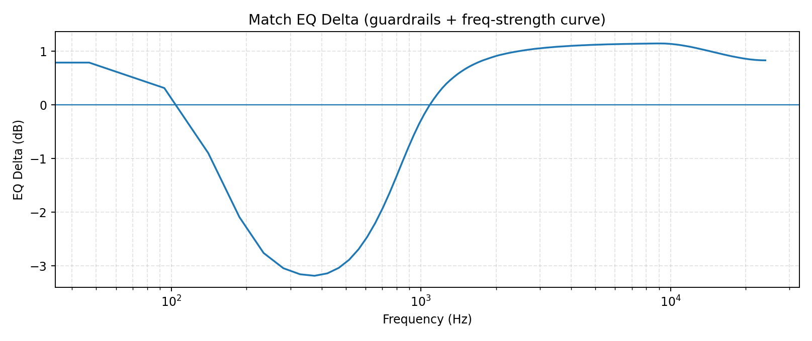
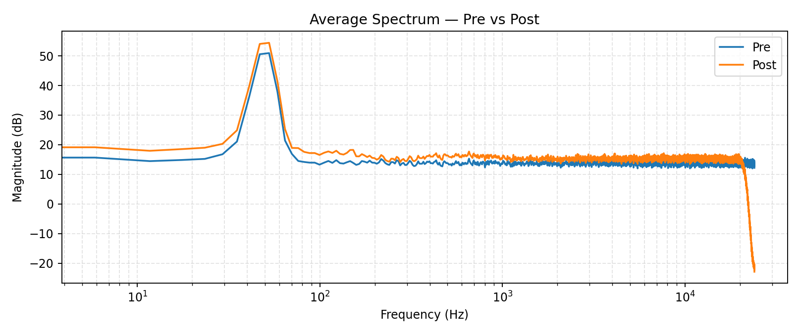

# Enhancement Report - AuralMind Maestro v7.2 HiFi

## Match EQ Delta Curve



## Spectrum Overlay



## Debug JSON

```json
{
  "version": "v7.3-hifi",
  "paths": {
    "reference": "c:\\Users\\goku\\LLM_uncensored\\Scripts\\test_maestro\\test_ref.wav",
    "target": "c:\\Users\\goku\\LLM_uncensored\\Scripts\\test_maestro\\test_ref.wav",
    "out": "c:\\Users\\goku\\LLM_uncensored\\Scripts\\test_maestro\\batch_out\\test_ref_balanced_v7_v7.3-hifi.wav"
  },
  "stems": {
    "enabled": false
  },
  "stem_block": {
    "enabled": false,
    "key_glow": {
      "enabled": true,
      "key": "G major",
      "glow_gain_db": 0.8,
      "glow_q": 1.2,
      "mix": 0.45,
      "bands": [
        {
          "f0": 146.8323839587038,
          "q": 1.2,
          "gain_db": 0.6000000000000001
        },
        {
          "f0": 164.81377845643496,
          "q": 1.2,
          "gain_db": 0.6000000000000001
        },
        {
          "f0": 184.9972113558172,
          "q": 1.2,
          "gain_db": 0.6000000000000001
        },
        {
          "f0": 195.99771799087463,
          "q": 1.2,
          "gain_db": 0.6000000000000001
        },
        {
          "f0": 220.0,
          "q": 1.2,
          "gain_db": 0.6016
        },
        {
          "f0": 246.94165062806206,
          "q": 1.2,
          "gain_db": 0.603755332050245
        },
        {
          "f0": 261.6255653005986,
          "q": 1.2,
          "gain_db": 0.6049300452240479
        },
        {
          "f0": 293.6647679174076,
          "q": 1.2,
          "gain_db": 0.6074931814333926
        },
        {
          "f0": 329.6275569128699,
          "q": 1.2,
          "gain_db": 0.6103702045530297
        },
        {
          "f0": 369.9944227116344,
          "q": 1.2,
          "gain_db": 0.6135995538169308
        },
        {
          "f0": 391.99543598174927,
          "q": 1.2,
          "gain_db": 0.61535963487854
        },
        {
          "f0": 440.0,
          "q": 1.2,
          "gain_db": 0.6192000000000001
        },
        {
          "f0": 493.8833012561241,
          "q": 1.2,
          "gain_db": 0.6235106641004899
        },
        {
          "f0": 523.2511306011972,
          "q": 1.2,
          "gain_db": 0.6258600904480959
        },
        {
          "f0": 587.3295358348151,
          "q": 1.2,
          "gain_db": 0.6309863628667852
        },
        {
          "f0": 659.2551138257398,
          "q": 1.2,
          "gain_db": 0.6367404091060592
        },
        {
          "f0": 739.9888454232688,
          "q": 1.2,
          "gain_db": 0.6431991076338616
        },
        {
          "f0": 783.9908719634985,
          "q": 1.2,
          "gain_db": 0.6467192697570799
        }
      ]
    },
    "scale_shimmer": {
      "enabled": false
    },
    "snare_detect": {
      "enabled": true,
      "count": 14,
      "band_low": 1300.0,
      "band_high": 5200.0,
      "hop": 256
    }
  },
  "match_eq": {
    "enabled": true,
    "numtaps": 4097,
    "max_gain_db": 5.8,
    "smooth_hz": 95.0,
    "eq_phase": "minimum",
    "minphase_nfft": 16384,
    "match_strength": 0.63,
    "match_lo_hz": 120.0,
    "match_hi_hz": 9000.0,
    "match_lo_factor": 0.72,
    "match_hi_factor": 0.72,
    "guardrails": true,
    "eq_curve": {
      "freqs_hz": [
        0.0,
        46.875,
        93.75,
        140.625,
        187.5,
        234.375,
        281.25,
        328.125,
        375.0,
        421.875,
        468.75,
        515.625,
        562.5,
        609.375,
        656.25,
        703.125,
        750.0,
        796.875,
        843.75,
        890.625,
        937.5,
        984.375,
        1031.25,
        1078.125,
        1125.0,
        1171.875,
        1218.75,
        1265.625,
        1312.5,
        1359.375,
        1406.25,
        1453.125,
        1500.0,
        1546.875,
        1593.75,
        1640.625,
        1687.5,
        1734.375,
        1781.25,
        1828.125,
        1875.0,
        1921.875,
        1968.75,
        2015.625,
        2062.5,
        2109.375,
        2156.25,
        2203.125,
        2250.0,
        2296.875,
        2343.75,
        2390.625,
        2437.5,
        2484.375,
        2531.25,
        2578.125,
        2625.0,
        2671.875,
        2718.75,
        2765.625,
        2812.5,
        2859.375,
        2906.25,
        2953.125,
        3005.859375,
        3052.734375,
        3099.609375,
        3146.484375,
        3193.359375,
        3240.234375,
        3287.109375,
        3333.984375,
        3380.859375,
        3427.734375,
        3474.609375,
        3521.484375,
        3568.359375,
        3615.234375,
        3662.109375,
        3708.984375,
        3755.859375,
        3802.734375,
        3849.609375,
        3896.484375,
        3943.359375,
        3990.234375,
        4037.109375,
        4083.984375,
        4130.859375,
        4177.734375,
        4224.609375,
        4271.484375,
        4318.359375,
        4365.234375,
        4412.109375,
        4458.984375,
        4505.859375,
        4552.734375,
        4599.609375,
        4646.484375,
        4693.359375,
        4740.234375,
        4787.109375,
        4833.984375,
        4880.859375,
        4927.734375,
        4974.609375,
        5021.484375,
        5068.359375,
        5115.234375,
        5162.109375,
        5208.984375,
        5255.859375,
        5302.734375,
        5349.609375,
        5396.484375,
        5443.359375,
        5490.234375,
        5537.109375,
        5583.984375,
        5630.859375,
        5677.734375,
        5724.609375,
        5771.484375,
        5818.359375,
        5865.234375,
        5912.109375,
        5958.984375,
        6011.71875,
        6058.59375,
        6105.46875,
        6152.34375,
        6199.21875,
        6246.09375,
        6292.96875,
        6339.84375,
        6386.71875,
        6433.59375,
        6480.46875,
        6527.34375,
        6574.21875,
        6621.09375,
        6667.96875,
        6714.84375,
        6761.71875,
        6808.59375,
        6855.46875,
        6902.34375,
        6949.21875,
        6996.09375,
        7042.96875,
        7089.84375,
        7136.71875,
        7183.59375,
        7230.46875,
        7277.34375,
        7324.21875,
        7371.09375,
        7417.96875,
        7464.84375,
        7511.71875,
        7558.59375,
        7605.46875,
        7652.34375,
        7699.21875,
        7746.09375,
        7792.96875,
        7839.84375,
        7886.71875,
        7933.59375,
        7980.46875,
        8027.34375,
        8074.21875,
        8121.09375,
        8167.96875,
        8214.84375,
        8261.71875,
        8308.59375,
        8355.46875,
        8402.34375,
        8449.21875,
        8496.09375,
        8542.96875,
        8589.84375,
        8636.71875,
        8683.59375,
        8730.46875,
        8777.34375,
        8824.21875,
        8871.09375,
        8917.96875,
        8964.84375,
        9017.578125,
        9064.453125,
        9111.328125,
        9158.203125,
        9205.078125,
        9251.953125,
        9298.828125,
        9345.703125,
        9392.578125,
        9439.453125,
        9486.328125,
        9533.203125,
        9580.078125,
        9626.953125,
        9673.828125,
        9720.703125,
        9767.578125,
        9814.453125,
        9861.328125,
        9908.203125,
        9955.078125,
        10001.953125,
        10048.828125,
        10095.703125,
        10142.578125,
        10189.453125,
        10236.328125,
        10283.203125,
        10330.078125,
        10376.953125,
        10423.828125,
        10470.703125,
        10517.578125,
        10564.453125,
        10611.328125,
        10658.203125,
        10705.078125,
        10751.953125,
        10798.828125,
        10845.703125,
        10892.578125,
        10939.453125,
        10986.328125,
        11033.203125,
        11080.078125,
        11126.953125,
        11173.828125,
        11220.703125,
        11267.578125,
        11314.453125,
        11361.328125,
        11408.203125,
        11455.078125,
        11501.953125,
        11548.828125,
        11595.703125,
        11642.578125,
        11689.453125,
        11736.328125,
        11783.203125,
        11830.078125,
        11876.953125,
        11923.828125,
        11970.703125,
        12023.4375,
        12070.3125,
        12117.1875,
        12164.0625,
        12210.9375,
        12257.8125,
        12304.6875,
        12351.5625,
        12398.4375,
        12445.3125,
        12492.1875,
        12539.0625,
        12585.9375,
        12632.8125,
        12679.6875,
        12726.5625,
        12773.4375,
        12820.3125,
        12867.1875,
        12914.0625,
        12960.9375,
        13007.8125,
        13054.6875,
        13101.5625,
        13148.4375,
        13195.3125,
        13242.1875,
        13289.0625,
        13335.9375,
        13382.8125,
        13429.6875,
        13476.5625,
        13523.4375,
        13570.3125,
        13617.1875,
        13664.0625,
        13710.9375,
        13757.8125,
        13804.6875,
        13851.5625,
        13898.4375,
        13945.3125,
        13992.1875,
        14039.0625,
        14085.9375,
        14132.8125,
        14179.6875,
        14226.5625,
        14273.4375,
        14320.3125,
        14367.1875,
        14414.0625,
        14460.9375,
        14507.8125,
        14554.6875,
        14601.5625,
        14648.4375,
        14695.3125,
        14742.1875,
        14789.0625,
        14835.9375,
        14882.8125,
        14929.6875,
        14976.5625,
        15029.296875,
        15076.171875,
        15123.046875,
        15169.921875,
        15216.796875,
        15263.671875,
        15310.546875,
        15357.421875,
        15404.296875,
        15451.171875,
        15498.046875,
        15544.921875,
        15591.796875,
        15638.671875,
        15685.546875,
        15732.421875,
        15779.296875,
        15826.171875,
        15873.046875,
        15919.921875,
        15966.796875,
        16013.671875,
        16060.546875,
        16107.421875,
        16154.296875,
        16201.171875,
        16248.046875,
        16294.921875,
        16341.796875,
        16388.671875,
        16435.546875,
        16482.421875,
        16529.296875,
        16576.171875,
        16623.046875,
        16669.921875,
        16716.796875,
        16763.671875,
        16810.546875,
        16857.421875,
        16904.296875,
        16951.171875,
        16998.046875,
        17044.921875,
        17091.796875,
        17138.671875,
        17185.546875,
        17232.421875,
        17279.296875,
        17326.171875,
        17373.046875,
        17419.921875,
        17466.796875,
        17513.671875,
        17560.546875,
        17607.421875,
        17654.296875,
        17701.171875,
        17748.046875,
        17794.921875,
        17841.796875,
        17888.671875,
        17935.546875,
        17982.421875,
        18035.15625,
        18082.03125,
        18128.90625,
        18175.78125,
        18222.65625,
        18269.53125,
        18316.40625,
        18363.28125,
        18410.15625,
        18457.03125,
        18503.90625,
        18550.78125,
        18597.65625,
        18644.53125,
        18691.40625,
        18738.28125,
        18785.15625,
        18832.03125,
        18878.90625,
        18925.78125,
        18972.65625,
        19019.53125,
        19066.40625,
        19113.28125,
        19160.15625,
        19207.03125,
        19253.90625,
        19300.78125,
        19347.65625,
        19394.53125,
        19441.40625,
        19488.28125,
        19535.15625,
        19582.03125,
        19628.90625,
        19675.78125,
        19722.65625,
        19769.53125,
        19816.40625,
        19863.28125,
        19910.15625,
        19957.03125,
        20003.90625,
        20050.78125,
        20097.65625,
        20144.53125,
        20191.40625,
        20238.28125,
        20285.15625,
        20332.03125,
        20378.90625,
        20425.78125,
        20472.65625,
        20519.53125,
        20566.40625,
        20613.28125,
        20660.15625,
        20707.03125,
        20753.90625,
        20800.78125,
        20847.65625,
        20894.53125,
        20941.40625,
        20988.28125,
        21041.015625,
        21087.890625,
        21134.765625,
        21181.640625,
        21228.515625,
        21275.390625,
        21322.265625,
        21369.140625,
        21416.015625,
        21462.890625,
        21509.765625,
        21556.640625,
        21603.515625,
        21650.390625,
        21697.265625,
        21744.140625,
        21791.015625,
        21837.890625,
        21884.765625,
        21931.640625,
        21978.515625,
        22025.390625,
        22072.265625,
        22119.140625,
        22166.015625,
        22212.890625,
        22259.765625,
        22306.640625,
        22353.515625,
        22400.390625,
        22447.265625,
        22494.140625,
        22541.015625,
        22587.890625,
        22634.765625,
        22681.640625,
        22728.515625,
        22775.390625,
        22822.265625,
        22869.140625,
        22916.015625,
        22962.890625,
        23009.765625,
        23056.640625,
        23103.515625,
        23150.390625,
        23197.265625,
        23244.140625,
        23291.015625,
        23337.890625,
        23384.765625,
        23431.640625,
        23478.515625,
        23525.390625,
        23572.265625,
        23619.140625,
        23666.015625,
        23712.890625,
        23759.765625,
        23806.640625,
        23853.515625,
        23900.390625,
        23947.265625,
        24000.0
      ],
      "delta_db": [
        0.7591251134872437,
        0.788574755191803,
        0.3144568204879761,
        -0.8978643417358398,
        -2.0914134979248047,
        -2.7596163749694824,
        -3.0432984828948975,
        -3.1558196544647217,
        -3.183695077896118,
        -3.1387722492218018,
        -3.036567449569702,
        -2.886002779006958,
        -2.690993309020996,
        -2.4594998359680176,
        -2.200974464416504,
        -1.9231503009796143,
        -1.6334284543991089,
        -1.3404462337493896,
        -1.0568495988845825,
        -0.7944585680961609,
        -0.5578296184539795,
        -0.3503398895263672,
        -0.17341919243335724,
        -0.021151261404156685,
        0.10691337287425995,
        0.21827813982963562,
        0.3148921728134155,
        0.39653274416923523,
        0.46413367986679077,
        0.5238227844238281,
        0.5778460502624512,
        0.6238279938697815,
        0.6650590300559998,
        0.7024207711219788,
        0.7341244220733643,
        0.7631741762161255,
        0.7892249822616577,
        0.8126044273376465,
        0.8336107134819031,
        0.8518332839012146,
        0.8697195649147034,
        0.8858189582824707,
        0.9012109041213989,
        0.915790855884552,
        0.9279338717460632,
        0.9380066394805908,
        0.9484294652938843,
        0.9587028622627258,
        0.9675891399383545,
        0.9758033752441406,
        0.9833768010139465,
        0.9907610416412354,
        0.9975022673606873,
        1.0038907527923584,
        1.0102689266204834,
        1.0164430141448975,
        1.0214014053344727,
        1.0262805223464966,
        1.0311205387115479,
        1.0351496934890747,
        1.039791464805603,
        1.0446608066558838,
        1.0481011867523193,
        1.051334261894226,
        1.0556843280792236,
        1.0593092441558838,
        1.061720609664917,
        1.0643165111541748,
        1.0675092935562134,
        1.0700647830963135,
        1.0725852251052856,
        1.0752209424972534,
        1.0772417783737183,
        1.0792642831802368,
        1.0815593004226685,
        1.0840773582458496,
        1.0858579874038696,
        1.0877314805984497,
        1.0895568132400513,
        1.0914689302444458,
        1.0930969715118408,
        1.0947396755218506,
        1.0961570739746094,
        1.0968989133834839,
        1.0987308025360107,
        1.100551962852478,
        1.1015965938568115,
        1.1028766632080078,
        1.1040935516357422,
        1.1055994033813477,
        1.1068006753921509,
        1.1074219942092896,
        1.1086714267730713,
        1.1102814674377441,
        1.110884428024292,
        1.1111817359924316,
        1.1122069358825684,
        1.1130036115646362,
        1.1140788793563843,
        1.115084171295166,
        1.1158206462860107,
        1.1169862747192383,
        1.1180580854415894,
        1.1184382438659668,
        1.119140625,
        1.1199290752410889,
        1.1205663681030273,
        1.120835542678833,
        1.1218510866165161,
        1.122917652130127,
        1.123094916343689,
        1.1232696771621704,
        1.123885154724121,
        1.1249178647994995,
        1.1258715391159058,
        1.1260976791381836,
        1.126233696937561,
        1.12699556350708,
        1.1279468536376953,
        1.1286139488220215,
        1.1286948919296265,
        1.1286661624908447,
        1.1292469501495361,
        1.1296371221542358,
        1.13009512424469,
        1.1307064294815063,
        1.130872368812561,
        1.131021499633789,
        1.131890892982483,
        1.1322356462478638,
        1.132272720336914,
        1.1326812505722046,
        1.133376121520996,
        1.1333259344100952,
        1.1336363554000854,
        1.1342867612838745,
        1.1347765922546387,
        1.135335087776184,
        1.1351964473724365,
        1.1351497173309326,
        1.1356104612350464,
        1.1361207962036133,
        1.1363266706466675,
        1.1362946033477783,
        1.1364881992340088,
        1.137103796005249,
        1.1375982761383057,
        1.1379374265670776,
        1.138043761253357,
        1.1379798650741577,
        1.137963891029358,
        1.138350009918213,
        1.1387279033660889,
        1.138893961906433,
        1.1390057802200317,
        1.1393779516220093,
        1.1396534442901611,
        1.1398931741714478,
        1.1401811838150024,
        1.140457272529602,
        1.140575885772705,
        1.140809416770935,
        1.140942931175232,
        1.1410448551177979,
        1.1415736675262451,
        1.1417245864868164,
        1.1415114402770996,
        1.1413565874099731,
        1.141621708869934,
        1.141708254814148,
        1.1419284343719482,
        1.1422617435455322,
        1.142590880393982,
        1.1429972648620605,
        1.1431035995483398,
        1.1431910991668701,
        1.1434088945388794,
        1.1431653499603271,
        1.1432292461395264,
        1.1436339616775513,
        1.1438943147659302,
        1.1438816785812378,
        1.1438829898834229,
        1.1438266038894653,
        1.1440536975860596,
        1.1445434093475342,
        1.1446596384048462,
        1.1445729732513428,
        1.1444758176803589,
        1.144491195678711,
        1.1447643041610718,
        1.1450510025024414,
        1.1451114416122437,
        1.1450904607772827,
        1.1452583074569702,
        1.1452699899673462,
        1.145164132118225,
        1.1450918912887573,
        1.144845962524414,
        1.144455909729004,
        1.144054651260376,
        1.1439138650894165,
        1.1437833309173584,
        1.1432781219482422,
        1.1426666975021362,
        1.1420631408691406,
        1.1415895223617554,
        1.1412501335144043,
        1.1403640508651733,
        1.1396125555038452,
        1.1388031244277954,
        1.1379364728927612,
        1.1370943784713745,
        1.136460781097412,
        1.1358519792556763,
        1.1352324485778809,
        1.1342843770980835,
        1.1332224607467651,
        1.1322264671325684,
        1.131388783454895,
        1.130523443222046,
        1.1293679475784302,
        1.1283715963363647,
        1.1271182298660278,
        1.1258999109268188,
        1.1248911619186401,
        1.123608112335205,
        1.1224757432937622,
        1.1214289665222168,
        1.1202176809310913,
        1.1190369129180908,
        1.1178826093673706,
        1.1165980100631714,
        1.1152595281600952,
        1.1138619184494019,
        1.112667202949524,
        1.111268401145935,
        1.1098437309265137,
        1.1085638999938965,
        1.1073704957962036,
        1.106044054031372,
        1.104584813117981,
        1.1030867099761963,
        1.1017789840698242,
        1.100328803062439,
        1.0989248752593994,
        1.097425937652588,
        1.0959033966064453,
        1.094548225402832,
        1.0930134057998657,
        1.0914902687072754,
        1.0898771286010742,
        1.088545322418213,
        1.087074875831604,
        1.0852547883987427,
        1.0835384130477905,
        1.0817936658859253,
        1.0804381370544434,
        1.078905701637268,
        1.0772488117218018,
        1.0756841897964478,
        1.0743049383163452,
        1.0727851390838623,
        1.0710266828536987,
        1.069277048110962,
        1.067628026008606,
        1.066105842590332,
        1.0645127296447754,
        1.062898874282837,
        1.0612043142318726,
        1.0594427585601807,
        1.0578579902648926,
        1.0563993453979492,
        1.05482017993927,
        1.0532416105270386,
        1.051615834236145,
        1.0499306917190552,
        1.0482069253921509,
        1.0466985702514648,
        1.044958233833313,
        1.0431832075119019,
        1.0416816473007202,
        1.0400054454803467,
        1.0384029150009155,
        1.0367647409439087,
        1.0352317094802856,
        1.0335907936096191,
        1.031815767288208,
        1.0301834344863892,
        1.0285899639129639,
        1.027174711227417,
        1.0256223678588867,
        1.0236481428146362,
        1.022118091583252,
        1.020611047744751,
        1.0189186334609985,
        1.0172702074050903,
        1.015742540359497,
        1.0142383575439453,
        1.0126657485961914,
        1.0109174251556396,
        1.0094505548477173,
        1.0077425241470337,
        1.0057963132858276,
        1.0044331550598145,
        1.0031732320785522,
        1.0014774799346924,
        0.9997040033340454,
        0.9980165958404541,
        0.9965256452560425,
        0.9951513409614563,
        0.9936219453811646,
        0.9918414354324341,
        0.9903146624565125,
        0.9888797402381897,
        0.9874253273010254,
        0.9857615828514099,
        0.9841194748878479,
        0.9825961589813232,
        0.981164276599884,
        0.9793596863746643,
        0.9778575897216797,
        0.9764365553855896,
        0.9748973846435547,
        0.9733991026878357,
        0.9718427658081055,
        0.9704040884971619,
        0.9689629077911377,
        0.9674990177154541,
        0.9658423662185669,
        0.9644051194190979,
        0.9630629420280457,
        0.9616097807884216,
        0.960114598274231,
        0.9585926532745361,
        0.9572955369949341,
        0.9558517932891846,
        0.9543486833572388,
        0.9530398845672607,
        0.95175701379776,
        0.9501065611839294,
        0.9487580060958862,
        0.9475113153457642,
        0.9461437463760376,
        0.9449109435081482,
        0.9434758424758911,
        0.9419708251953125,
        0.940719485282898,
        0.9394015669822693,
        0.9380987882614136,
        0.9368187189102173,
        0.9354484677314758,
        0.9341586232185364,
        0.9328456521034241,
        0.9315154552459717,
        0.9302496314048767,
        0.9289731383323669,
        0.9276916980743408,
        0.9263272881507874,
        0.9249683618545532,
        0.9237521290779114,
        0.9225624799728394,
        0.9212387204170227,
        0.9200748801231384,
        0.9189644455909729,
        0.9177713990211487,
        0.9166193008422852,
        0.9154253005981445,
        0.9142426252365112,
        0.9129869937896729,
        0.9117103815078735,
        0.9105695486068726,
        0.9094299077987671,
        0.908370852470398,
        0.9072557687759399,
        0.9062511920928955,
        0.905015230178833,
        0.9037169814109802,
        0.9027912020683289,
        0.9017636179924011,
        0.9005640745162964,
        0.8994800448417664,
        0.8984040021896362,
        0.8974407911300659,
        0.8962256908416748,
        0.8950191736221313,
        0.8939276337623596,
        0.892975389957428,
        0.8920117616653442,
        0.8909729719161987,
        0.8899456262588501,
        0.8889274001121521,
        0.8879649639129639,
        0.8870619535446167,
        0.8860039114952087,
        0.8850785493850708,
        0.8840935826301575,
        0.8832582831382751,
        0.8823670148849487,
        0.8813347220420837,
        0.8804572224617004,
        0.8794020414352417,
        0.8784424066543579,
        0.8776569962501526,
        0.8767666220664978,
        0.8759459853172302,
        0.8750578761100769,
        0.8742155432701111,
        0.8734217286109924,
        0.8726281523704529,
        0.8718568086624146,
        0.8708913922309875,
        0.8699667453765869,
        0.8692278861999512,
        0.8684511780738831,
        0.8675994277000427,
        0.8667344450950623,
        0.865933358669281,
        0.865197479724884,
        0.8644471764564514,
        0.8637529611587524,
        0.862968385219574,
        0.8623248934745789,
        0.8616883158683777,
        0.8609623312950134,
        0.8602609634399414,
        0.8594954609870911,
        0.8588671684265137,
        0.8581724762916565,
        0.8573365807533264,
        0.8567124605178833,
        0.856022834777832,
        0.8553383350372314,
        0.8546675443649292,
        0.8540146946907043,
        0.853498637676239,
        0.852855384349823,
        0.8521926403045654,
        0.8516611456871033,
        0.851180911064148,
        0.8506061434745789,
        0.8499510884284973,
        0.8492777347564697,
        0.8487638235092163,
        0.8481759428977966,
        0.847658097743988,
        0.8472354412078857,
        0.8467285633087158,
        0.8461453914642334,
        0.8455422520637512,
        0.8451242446899414,
        0.8447316288948059,
        0.8441892862319946,
        0.8436828255653381,
        0.843135416507721,
        0.8426147699356079,
        0.8423613905906677,
        0.8420118689537048,
        0.8414510488510132,
        0.8410483598709106,
        0.8406056761741638,
        0.8402543067932129,
        0.8398597836494446,
        0.839445948600769,
        0.8391607403755188,
        0.8386774063110352,
        0.8383021354675293,
        0.8380653262138367,
        0.8377721905708313,
        0.8374640941619873,
        0.8369925022125244,
        0.836554765701294,
        0.836223840713501,
        0.8359391093254089,
        0.835756778717041,
        0.8355087637901306,
        0.8352533578872681,
        0.8349730372428894,
        0.8346385955810547,
        0.8344714641571045,
        0.8342245817184448,
        0.8338852524757385,
        0.8335989713668823,
        0.8333976864814758,
        0.8331665992736816,
        0.8329664468765259,
        0.8327745795249939,
        0.8326080441474915,
        0.8324961066246033,
        0.8322899341583252,
        0.8320291042327881,
        0.8319697380065918,
        0.8317456245422363,
        0.8315801024436951,
        0.831466555595398,
        0.8313286304473877,
        0.8312221765518188,
        0.8311482667922974,
        0.831064760684967,
        0.8309764266014099,
        0.8308263421058655,
        0.8306665420532227,
        0.8305933475494385,
        0.8305001854896545,
        0.8305167555809021,
        0.8305343389511108,
        0.8305076360702515,
        0.8304282426834106,
        0.8304867148399353,
        0.8304353356361389,
        0.830399751663208,
        0.8307320475578308
      ]
    }
  },
  "perceptual": {
    "enabled": true,
    "pre": {
      "enabled": true,
      "mode": "erb",
      "n_bands": 24,
      "fast": true,
      "rmse_db": 1.1349465185295273,
      "mae_db": 0.7259495755261867,
      "wrmse_db": 0.7846627795280554,
      "score_0_100": 92.15337220471945,
      "band_centers_hz": [
        41.41544163465481,
        87.93250180957403,
        142.45640657163278,
        206.365350501519,
        281.274752754666,
        369.07808982873826,
        471.99475675514236,
        592.6261664964939,
        734.0215055681715,
        899.7548079813769,
        1094.0152956970494,
        1321.7132691160843,
        1588.6042241878129,
        1901.4343334308696,
        2268.1109681737807,
        2697.9025722866777,
        3201.672939589875,
        3792.1558167429057,
        4484.276772720197,
        5295.530470731788,
        6246.42287884878,
        7360.989597041554,
        8667.403402324744,
        10198.686368858924
      ],
      "band_ref_db": [
        21.004916073172176,
        7.695262372779904,
        -8.088393104974223,
        -6.554903847347573,
        -6.725596254298422,
        -5.8394804920912105,
        -5.367272478372353,
        -4.219155910670928,
        -3.932189360150794,
        -3.1531570599078655,
        -2.3831628729309706,
        -1.746358055539929,
        -1.2757449074280736,
        -0.2620379580036243,
        0.2620379580036243,
        0.9915664479007376,
        1.6861276687378215,
        2.4746288516185047,
        3.25030330433637,
        3.797884455237295,
        4.455753487776345,
        5.231430313891693,
        5.856811151885186,
        2.1788747203045347
      ],
      "band_tgt_db": [
        20.738885185155308,
        7.450800099399125,
        -7.029364864757758,
        -4.413146899306502,
        -4.335891470310974,
        -3.408539898793908,
        -3.0432992866249613,
        -2.178353147958113,
        -2.3710859631557852,
        -2.1683562589655665,
        -1.8590021899263576,
        -1.487086874066108,
        -1.159632341204901,
        -0.24136444896177167,
        0.24136444896177167,
        0.9267846568183984,
        1.5991320597336482,
        2.366530491255485,
        3.1369429386943963,
        3.6882453368136474,
        4.325887295420969,
        5.1031728993596275,
        5.714517399524777,
        2.022872839561817
      ],
      "band_delta_db": [
        -0.2660308880168678,
        -0.24446227338077975,
        1.059028240216465,
        2.1417569480410705,
        2.3897047839874475,
        2.4309405932973025,
        2.323973191747392,
        2.040802762712815,
        1.5611033969950086,
        0.984800800942299,
        0.524160683004613,
        0.2592711814738209,
        0.11611256622317256,
        0.02067350904185261,
        -0.02067350904185261,
        -0.06478179108233917,
        -0.08699560900417325,
        -0.10809836036301945,
        -0.11336036564197371,
        -0.10963911842364737,
        -0.1298661923553759,
        -0.12825741453206518,
        -0.1422937523604091,
        -0.1560018807427177
      ],
      "lowmid_excess_db": 2.320800775108607,
      "presence_delta_db": -0.08392479225950093,
      "air_delta_db": -0.1491478165515634,
      "presence_deficit_db": 0.08392479225950093,
      "air_deficit_db": 0.1491478165515634
    },
    "guide": {
      "applied": true,
      "mix": 0.35,
      "cut_lowmid_db": 0.4873681627728074,
      "boost_presence_db": 0.01615552250995393,
      "boost_air_db": 0.020880694317218874,
      "bands": [
        [
          250.0,
          0.85,
          -0.4873681627728074
        ]
      ],
      "lowmid_excess_db": 2.320800775108607,
      "presence_deficit_db": 0.08392479225950093,
      "air_deficit_db": 0.1491478165515634
    },
    "post": {
      "enabled": true,
      "mode": "erb",
      "n_bands": 24,
      "fast": true,
      "rmse_db": 0.7716681343192048,
      "mae_db": 0.43876143206983453,
      "wrmse_db": 0.3470619750033005,
      "score_0_100": 96.52938024996699,
      "band_centers_hz": [
        41.41544163465481,
        87.93250180957403,
        142.45640657163278,
        206.365350501519,
        281.274752754666,
        369.07808982873826,
        471.99475675514236,
        592.6261664964939,
        734.0215055681715,
        899.7548079813769,
        1094.0152956970494,
        1321.7132691160843,
        1588.6042241878129,
        1901.4343334308696,
        2268.1109681737807,
        2697.9025722866777,
        3201.672939589875,
        3792.1558167429057,
        4484.276772720197,
        5295.530470731788,
        6246.42287884878,
        7360.989597041554,
        8667.403402324744,
        10198.686368858924
      ],
      "band_ref_db": [
        21.004916073172176,
        7.695262372779904,
        -8.088393104974223,
        -6.554903847347573,
        -6.725596254298422,
        -5.8394804920912105,
        -5.367272478372353,
        -4.219155910670928,
        -3.932189360150794,
        -3.1531570599078655,
        -2.3831628729309706,
        -1.746358055539929,
        -1.2757449074280736,
        -0.2620379580036243,
        0.2620379580036243,
        0.9915664479007376,
        1.6861276687378215,
        2.4746288516185047,
        3.25030330433637,
        3.797884455237295,
        4.455753487776345,
        5.231430313891693,
        5.856811151885186,
        2.1788747203045347
      ],
      "band_tgt_db": [
        22.981913567634543,
        9.662063522105395,
        -6.312978268455076,
        -6.502422387922699,
        -6.968406155277252,
        -5.44890512961258,
        -4.43699129380877,
        -3.1364642691603493,
        -3.0447836549440126,
        -2.6534008195021954,
        -2.2142936773207076,
        -1.7079348418464306,
        -1.294372702114046,
        -0.27405594539118283,
        0.2740559453911864,
        0.9827525647387674,
        1.6886014734754937,
        2.4396780919068277,
        3.1907906004485227,
        3.80811395584319,
        4.552920558965745,
        5.378100631444305,
        5.920288101634359,
        2.23068294574351
      ],
      "band_delta_db": [
        1.976997494462367,
        1.9668011493254909,
        1.7754148365191469,
        0.05248145942487348,
        -0.24280990097883048,
        0.39057536247863034,
        0.930281184563583,
        1.0826916415105785,
        0.8874057052067812,
        0.4997562404056701,
        0.16886919561026303,
        0.038423213693498326,
        -0.018627794685972532,
        -0.012017987387558549,
        0.012017987387562101,
        -0.008813883161970182,
        0.002473804737672225,
        -0.03495075971167694,
        -0.05951270388784735,
        0.010229500605895225,
        0.09716707118939993,
        0.14667031755261206,
        0.06347694974917317,
        0.05180822543897534
      ],
      "lowmid_excess_db": 0.06674897364155778,
      "presence_delta_db": -0.013092675671727486,
      "air_delta_db": 0.05764258759407426,
      "presence_deficit_db": 0.013092675671727486,
      "air_deficit_db": 0.0
    }
  },
  "mono_sub": {
    "enabled": true,
    "cutoff_hz": 115.0,
    "mix": 0.78
  },
  "dynamic_sidechain": {
    "enabled": false
  },
  "transient_air": {
    "enabled": false
  },
  "tilt_eq": {
    "enabled": true,
    "tilt_db_per_oct": 0.11,
    "pivot_hz": 1050.0,
    "max_tilt_db": 3.0,
    "guard_lo_hz": 35.0,
    "guard_hi_hz": 14000.0,
    "numtaps": 513
  },
  "spatial": {
    "enabled": true,
    "side_hp_hz": 180.0,
    "width_mid": 1.05,
    "width_hi": 1.25,
    "corr": 1.0,
    "corr_min": 0.0
  },
  "movement": {
    "enabled": true,
    "amount": 0.1
  },
  "groove_glue": {
    "enabled": true,
    "mix": 0.1,
    "base_drive": 1.15,
    "dynamic": 0.18
  },
  "hooklift": {
    "enabled": false
  },
  "imd_guard": {
    "enabled": true,
    "split_hz": 160.0,
    "drive_db": 2.25,
    "mix": 0.85,
    "oversample": 4,
    "clip": {
      "drive_db": 2.25,
      "mix": 0.85,
      "oversample": 4
    }
  },
  "clarity_guard": {
    "enabled": true,
    "gr_scale": 1.0,
    "limit_gr_db": 0.0,
    "tilt_slope_db_per_oct": -0.048566952988031244,
    "tilt_correction_db_per_oct": 0.029140171792818744,
    "lowmid_excess_db": 2.1421892642974854,
    "presence_deficit_db": 0.0,
    "air_deficit_db": 0.0,
    "bands": [
      [
        250.0,
        0.85,
        -0.66
      ]
    ]
  },
  "post_clarity_limiter": {
    "enabled": true,
    "ceiling_dbfs": -1.0,
    "tp_oversample": 8,
    "min_gain_db": 0.0,
    "true_peak_dbfs": -2.493640473788633,
    "ceiling_chase_strength": 1.0
  },
  "post_clarity_limiter_tp_dbfs": -2.493640473788633,
  "finalize": {
    "enabled": true,
    "target_lufs": -11.4,
    "final_lufs": -10.777255543565113,
    "gain_db_total": 0.743907195889637,
    "target_peak_dbfs": -1.0,
    "final_true_peak_dbfs": -2.542972520765977,
    "iters": 2,
    "limiter": {
      "enabled": true,
      "ceiling_dbfs": -1.0,
      "tp_oversample": 8,
      "min_gain_db": 0.0,
      "true_peak_dbfs": -2.542972520765977,
      "ceiling_chase_strength": 1.0
    }
  },
  "transient_restore": {
    "enabled": true,
    "restore_db": 1.05,
    "band_low": 1500.0,
    "band_high": 6500.0,
    "attack_ms": 1.4,
    "decay_ms": 38.0,
    "mix": 0.55,
    "transients": 14,
    "post_tp_limiter": {
      "enabled": true,
      "ceiling_dbfs": -1.0,
      "tp_oversample": 8,
      "min_gain_db": 0.0,
      "true_peak_dbfs": -2.4843547634633083,
      "ceiling_chase_strength": 1.0
    }
  },
  "pre": {
    "lufs": -12.638585967025302,
    "translation": {
      "rms_db": -15.230336656092856,
      "peak_dbfs": -4.169353048167076,
      "crest_db": 11.060983607925781,
      "tilt_db_per_oct": 0.014522973860029145,
      "lowmid_db": 7.876528739929199,
      "presence_db": 7.798203468322754,
      "air_db": 7.8171234130859375,
      "lowmid_minus_presence_db": 0.07832527160644531
    },
    "true_peak_dbfs": -4.163574313159127,
    "peak_dbfs": -4.169353048167076
  },
  "post": {
    "lufs": -10.827491598673681,
    "translation": {
      "rms_db": -12.38750672628629,
      "peak_dbfs": -2.7097183405675596,
      "crest_db": 9.677788385718731,
      "tilt_db_per_oct": -0.09090568210472895,
      "lowmid_db": 9.556781768798828,
      "presence_db": 9.289731979370117,
      "air_db": 9.407444953918457,
      "lowmid_minus_presence_db": 0.26704978942871094
    },
    "true_peak_dbfs": -2.493640473788633,
    "peak_dbfs": -2.7097183405675596
  },
  "plots": {
    "eq_delta": "test_ref_balanced_v7_v7.3-hifi_Report_EQ_Delta.png",
    "spectrum_overlay": "test_ref_balanced_v7_v7.3-hifi_Report_Spectrum_Overlay.png"
  }
}
```