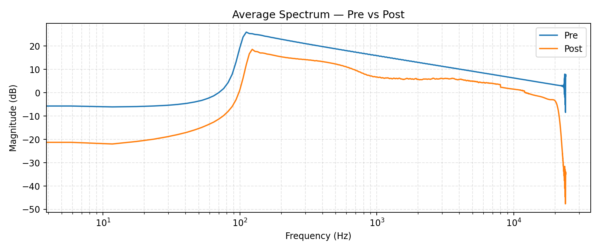

# Enhancement Report - AuralMind Maestro v7.2 HiFi

## Match EQ Delta Curve


## Spectrum Overlay



## Debug JSON

```json
{
  "version": "v7.3-hifi",
  "paths": {
    "reference": "c:\\Users\\goku\\LLM_uncensored\\Scripts\\test_maestro\\test_ref.wav",
    "target": "c:\\Users\\goku\\LLM_uncensored\\Scripts\\test_maestro\\test_tgt.wav",
    "out": "c:\\Users\\goku\\LLM_uncensored\\Scripts\\test_maestro\\batch_out\\test_tgt_balanced_v7_v7.3-hifi.wav"
  },
  "stems": {
    "enabled": false
  },
  "stem_block": {
    "enabled": false,
    "key_glow": {
      "enabled": true,
      "key": "A minor",
      "glow_gain_db": 0.8,
      "glow_q": 1.2,
      "mix": 0.45,
      "bands": [
        {
          "f0": 146.8323839587038,
          "q": 1.2,
          "gain_db": 0.6000000000000001
        },
        {
          "f0": 164.81377845643496,
          "q": 1.2,
          "gain_db": 0.6000000000000001
        },
        {
          "f0": 174.61411571650194,
          "q": 1.2,
          "gain_db": 0.6000000000000001
        },
        {
          "f0": 195.99771799087463,
          "q": 1.2,
          "gain_db": 0.6000000000000001
        },
        {
          "f0": 220.0,
          "q": 1.2,
          "gain_db": 0.6016
        },
        {
          "f0": 246.94165062806206,
          "q": 1.2,
          "gain_db": 0.603755332050245
        },
        {
          "f0": 261.6255653005986,
          "q": 1.2,
          "gain_db": 0.6049300452240479
        },
        {
          "f0": 293.6647679174076,
          "q": 1.2,
          "gain_db": 0.6074931814333926
        },
        {
          "f0": 329.6275569128699,
          "q": 1.2,
          "gain_db": 0.6103702045530297
        },
        {
          "f0": 349.2282314330039,
          "q": 1.2,
          "gain_db": 0.6119382585146403
        },
        {
          "f0": 391.99543598174927,
          "q": 1.2,
          "gain_db": 0.61535963487854
        },
        {
          "f0": 440.0,
          "q": 1.2,
          "gain_db": 0.6192000000000001
        },
        {
          "f0": 493.8833012561241,
          "q": 1.2,
          "gain_db": 0.6235106641004899
        },
        {
          "f0": 523.2511306011972,
          "q": 1.2,
          "gain_db": 0.6258600904480959
        },
        {
          "f0": 587.3295358348151,
          "q": 1.2,
          "gain_db": 0.6309863628667852
        },
        {
          "f0": 659.2551138257398,
          "q": 1.2,
          "gain_db": 0.6367404091060592
        },
        {
          "f0": 698.4564628660078,
          "q": 1.2,
          "gain_db": 0.6398765170292807
        },
        {
          "f0": 783.9908719634985,
          "q": 1.2,
          "gain_db": 0.6467192697570799
        }
      ]
    },
    "scale_shimmer": {
      "enabled": false
    },
    "snare_detect": {
      "enabled": true,
      "count": 7,
      "band_low": 1300.0,
      "band_high": 5200.0,
      "hop": 256
    }
  },
  "match_eq": {
    "enabled": true,
    "numtaps": 4097,
    "max_gain_db": 5.8,
    "smooth_hz": 95.0,
    "eq_phase": "minimum",
    "minphase_nfft": 16384,
    "match_strength": 0.63,
    "match_lo_hz": 120.0,
    "match_hi_hz": 9000.0,
    "match_lo_factor": 0.72,
    "match_hi_factor": 0.72,
    "guardrails": true,
    "eq_curve": {
      "freqs_hz": [
        0.0,
        46.875,
        93.75,
        140.625,
        187.5,
        234.375,
        281.25,
        328.125,
        375.0,
        421.875,
        468.75,
        515.625,
        562.5,
        609.375,
        656.25,
        703.125,
        750.0,
        796.875,
        843.75,
        890.625,
        937.5,
        984.375,
        1031.25,
        1078.125,
        1125.0,
        1171.875,
        1218.75,
        1265.625,
        1312.5,
        1359.375,
        1406.25,
        1453.125,
        1500.0,
        1546.875,
        1593.75,
        1640.625,
        1687.5,
        1734.375,
        1781.25,
        1828.125,
        1875.0,
        1921.875,
        1968.75,
        2015.625,
        2062.5,
        2109.375,
        2156.25,
        2203.125,
        2250.0,
        2296.875,
        2343.75,
        2390.625,
        2437.5,
        2484.375,
        2531.25,
        2578.125,
        2625.0,
        2671.875,
        2718.75,
        2765.625,
        2812.5,
        2859.375,
        2906.25,
        2953.125,
        3005.859375,
        3052.734375,
        3099.609375,
        3146.484375,
        3193.359375,
        3240.234375,
        3287.109375,
        3333.984375,
        3380.859375,
        3427.734375,
        3474.609375,
        3521.484375,
        3568.359375,
        3615.234375,
        3662.109375,
        3708.984375,
        3755.859375,
        3802.734375,
        3849.609375,
        3896.484375,
        3943.359375,
        3990.234375,
        4037.109375,
        4083.984375,
        4130.859375,
        4177.734375,
        4224.609375,
        4271.484375,
        4318.359375,
        4365.234375,
        4412.109375,
        4458.984375,
        4505.859375,
        4552.734375,
        4599.609375,
        4646.484375,
        4693.359375,
        4740.234375,
        4787.109375,
        4833.984375,
        4880.859375,
        4927.734375,
        4974.609375,
        5021.484375,
        5068.359375,
        5115.234375,
        5162.109375,
        5208.984375,
        5255.859375,
        5302.734375,
        5349.609375,
        5396.484375,
        5443.359375,
        5490.234375,
        5537.109375,
        5583.984375,
        5630.859375,
        5677.734375,
        5724.609375,
        5771.484375,
        5818.359375,
        5865.234375,
        5912.109375,
        5958.984375,
        6011.71875,
        6058.59375,
        6105.46875,
        6152.34375,
        6199.21875,
        6246.09375,
        6292.96875,
        6339.84375,
        6386.71875,
        6433.59375,
        6480.46875,
        6527.34375,
        6574.21875,
        6621.09375,
        6667.96875,
        6714.84375,
        6761.71875,
        6808.59375,
        6855.46875,
        6902.34375,
        6949.21875,
        6996.09375,
        7042.96875,
        7089.84375,
        7136.71875,
        7183.59375,
        7230.46875,
        7277.34375,
        7324.21875,
        7371.09375,
        7417.96875,
        7464.84375,
        7511.71875,
        7558.59375,
        7605.46875,
        7652.34375,
        7699.21875,
        7746.09375,
        7792.96875,
        7839.84375,
        7886.71875,
        7933.59375,
        7980.46875,
        8027.34375,
        8074.21875,
        8121.09375,
        8167.96875,
        8214.84375,
        8261.71875,
        8308.59375,
        8355.46875,
        8402.34375,
        8449.21875,
        8496.09375,
        8542.96875,
        8589.84375,
        8636.71875,
        8683.59375,
        8730.46875,
        8777.34375,
        8824.21875,
        8871.09375,
        8917.96875,
        8964.84375,
        9017.578125,
        9064.453125,
        9111.328125,
        9158.203125,
        9205.078125,
        9251.953125,
        9298.828125,
        9345.703125,
        9392.578125,
        9439.453125,
        9486.328125,
        9533.203125,
        9580.078125,
        9626.953125,
        9673.828125,
        9720.703125,
        9767.578125,
        9814.453125,
        9861.328125,
        9908.203125,
        9955.078125,
        10001.953125,
        10048.828125,
        10095.703125,
        10142.578125,
        10189.453125,
        10236.328125,
        10283.203125,
        10330.078125,
        10376.953125,
        10423.828125,
        10470.703125,
        10517.578125,
        10564.453125,
        10611.328125,
        10658.203125,
        10705.078125,
        10751.953125,
        10798.828125,
        10845.703125,
        10892.578125,
        10939.453125,
        10986.328125,
        11033.203125,
        11080.078125,
        11126.953125,
        11173.828125,
        11220.703125,
        11267.578125,
        11314.453125,
        11361.328125,
        11408.203125,
        11455.078125,
        11501.953125,
        11548.828125,
        11595.703125,
        11642.578125,
        11689.453125,
        11736.328125,
        11783.203125,
        11830.078125,
        11876.953125,
        11923.828125,
        11970.703125,
        12023.4375,
        12070.3125,
        12117.1875,
        12164.0625,
        12210.9375,
        12257.8125,
        12304.6875,
        12351.5625,
        12398.4375,
        12445.3125,
        12492.1875,
        12539.0625,
        12585.9375,
        12632.8125,
        12679.6875,
        12726.5625,
        12773.4375,
        12820.3125,
        12867.1875,
        12914.0625,
        12960.9375,
        13007.8125,
        13054.6875,
        13101.5625,
        13148.4375,
        13195.3125,
        13242.1875,
        13289.0625,
        13335.9375,
        13382.8125,
        13429.6875,
        13476.5625,
        13523.4375,
        13570.3125,
        13617.1875,
        13664.0625,
        13710.9375,
        13757.8125,
        13804.6875,
        13851.5625,
        13898.4375,
        13945.3125,
        13992.1875,
        14039.0625,
        14085.9375,
        14132.8125,
        14179.6875,
        14226.5625,
        14273.4375,
        14320.3125,
        14367.1875,
        14414.0625,
        14460.9375,
        14507.8125,
        14554.6875,
        14601.5625,
        14648.4375,
        14695.3125,
        14742.1875,
        14789.0625,
        14835.9375,
        14882.8125,
        14929.6875,
        14976.5625,
        15029.296875,
        15076.171875,
        15123.046875,
        15169.921875,
        15216.796875,
        15263.671875,
        15310.546875,
        15357.421875,
        15404.296875,
        15451.171875,
        15498.046875,
        15544.921875,
        15591.796875,
        15638.671875,
        15685.546875,
        15732.421875,
        15779.296875,
        15826.171875,
        15873.046875,
        15919.921875,
        15966.796875,
        16013.671875,
        16060.546875,
        16107.421875,
        16154.296875,
        16201.171875,
        16248.046875,
        16294.921875,
        16341.796875,
        16388.671875,
        16435.546875,
        16482.421875,
        16529.296875,
        16576.171875,
        16623.046875,
        16669.921875,
        16716.796875,
        16763.671875,
        16810.546875,
        16857.421875,
        16904.296875,
        16951.171875,
        16998.046875,
        17044.921875,
        17091.796875,
        17138.671875,
        17185.546875,
        17232.421875,
        17279.296875,
        17326.171875,
        17373.046875,
        17419.921875,
        17466.796875,
        17513.671875,
        17560.546875,
        17607.421875,
        17654.296875,
        17701.171875,
        17748.046875,
        17794.921875,
        17841.796875,
        17888.671875,
        17935.546875,
        17982.421875,
        18035.15625,
        18082.03125,
        18128.90625,
        18175.78125,
        18222.65625,
        18269.53125,
        18316.40625,
        18363.28125,
        18410.15625,
        18457.03125,
        18503.90625,
        18550.78125,
        18597.65625,
        18644.53125,
        18691.40625,
        18738.28125,
        18785.15625,
        18832.03125,
        18878.90625,
        18925.78125,
        18972.65625,
        19019.53125,
        19066.40625,
        19113.28125,
        19160.15625,
        19207.03125,
        19253.90625,
        19300.78125,
        19347.65625,
        19394.53125,
        19441.40625,
        19488.28125,
        19535.15625,
        19582.03125,
        19628.90625,
        19675.78125,
        19722.65625,
        19769.53125,
        19816.40625,
        19863.28125,
        19910.15625,
        19957.03125,
        20003.90625,
        20050.78125,
        20097.65625,
        20144.53125,
        20191.40625,
        20238.28125,
        20285.15625,
        20332.03125,
        20378.90625,
        20425.78125,
        20472.65625,
        20519.53125,
        20566.40625,
        20613.28125,
        20660.15625,
        20707.03125,
        20753.90625,
        20800.78125,
        20847.65625,
        20894.53125,
        20941.40625,
        20988.28125,
        21041.015625,
        21087.890625,
        21134.765625,
        21181.640625,
        21228.515625,
        21275.390625,
        21322.265625,
        21369.140625,
        21416.015625,
        21462.890625,
        21509.765625,
        21556.640625,
        21603.515625,
        21650.390625,
        21697.265625,
        21744.140625,
        21791.015625,
        21837.890625,
        21884.765625,
        21931.640625,
        21978.515625,
        22025.390625,
        22072.265625,
        22119.140625,
        22166.015625,
        22212.890625,
        22259.765625,
        22306.640625,
        22353.515625,
        22400.390625,
        22447.265625,
        22494.140625,
        22541.015625,
        22587.890625,
        22634.765625,
        22681.640625,
        22728.515625,
        22775.390625,
        22822.265625,
        22869.140625,
        22916.015625,
        22962.890625,
        23009.765625,
        23056.640625,
        23103.515625,
        23150.390625,
        23197.265625,
        23244.140625,
        23291.015625,
        23337.890625,
        23384.765625,
        23431.640625,
        23478.515625,
        23525.390625,
        23572.265625,
        23619.140625,
        23666.015625,
        23712.890625,
        23759.765625,
        23806.640625,
        23853.515625,
        23900.390625,
        23947.265625,
        24000.0
      ],
      "delta_db": [
        2.630880117416382,
        2.1411547660827637,
        -0.07501259446144104,
        -3.4673221111297607,
        -3.6540000438690186,
        -3.6540000438690186,
        -3.6540000438690186,
        -3.6540000438690186,
        -3.6540000438690186,
        -3.6540000438690186,
        -3.6540000438690186,
        -3.6540000438690186,
        -3.6540000438690186,
        -3.6540000438690186,
        -3.6540000438690186,
        -3.6540000438690186,
        -3.6540000438690186,
        -3.6465463638305664,
        -3.5719492435455322,
        -3.3287367820739746,
        -3.149806499481201,
        -2.8405442237854004,
        -2.5290863513946533,
        -2.447685718536377,
        -2.1927902698516846,
        -1.8853446245193481,
        -1.6909915208816528,
        -1.5469337701797485,
        -1.4235459566116333,
        -1.250193476676941,
        -0.9356908798217773,
        -0.8125389218330383,
        -0.7773048281669617,
        -0.8235155344009399,
        -0.7161199450492859,
        -0.4263255298137665,
        -0.2426495999097824,
        -0.11450685560703278,
        -0.12220361083745956,
        -0.0838242620229721,
        0.08370481431484222,
        0.029399743303656578,
        0.05613897368311882,
        0.07867743819952011,
        0.09664901345968246,
        0.16482937335968018,
        0.29280728101730347,
        0.5229154229164124,
        0.615548849105835,
        0.6292932629585266,
        0.6343762278556824,
        0.7071873545646667,
        0.7481710910797119,
        0.7902093529701233,
        0.9767811298370361,
        1.2540147304534912,
        1.1077501773834229,
        0.9803385138511658,
        1.1246726512908936,
        1.0551130771636963,
        1.1055412292480469,
        1.1988953351974487,
        1.3524364233016968,
        1.4615168571472168,
        1.4790946245193481,
        1.451879858970642,
        1.5066535472869873,
        1.6553939580917358,
        1.6872806549072266,
        1.6890933513641357,
        1.7254610061645508,
        1.6654562950134277,
        1.6650562286376953,
        1.8028005361557007,
        1.9035297632217407,
        2.0117955207824707,
        2.090519666671753,
        2.224618911743164,
        2.1942827701568604,
        2.043804883956909,
        2.055048704147339,
        1.9977989196777344,
        1.9652162790298462,
        1.9692094326019287,
        2.0847063064575195,
        2.3098511695861816,
        2.3469200134277344,
        2.4609806537628174,
        2.5761072635650635,
        2.5018811225891113,
        2.5298335552215576,
        2.5284528732299805,
        2.453897714614868,
        2.465280532836914,
        2.6148123741149902,
        2.5890090465545654,
        2.4512994289398193,
        2.6498050689697266,
        2.737947702407837,
        2.655470848083496,
        2.651143789291382,
        2.771116018295288,
        2.7880258560180664,
        2.724743604660034,
        2.759381055831909,
        2.8922059535980225,
        2.938258647918701,
        2.8124396800994873,
        2.9495792388916016,
        3.035005569458008,
        3.054499864578247,
        2.924825668334961,
        3.0108425617218018,
        3.159379482269287,
        2.972028970718384,
        3.096879720687866,
        3.217606544494629,
        2.92046856880188,
        2.831063747406006,
        3.0153648853302,
        3.2122654914855957,
        3.1209335327148438,
        3.0694477558135986,
        3.14439058303833,
        3.093684673309326,
        3.0840635299682617,
        3.1816890239715576,
        3.2099831104278564,
        3.2765092849731445,
        3.3126919269561768,
        3.294342517852783,
        3.232680320739746,
        3.1809890270233154,
        3.312852621078491,
        3.4462122917175293,
        3.4963417053222656,
        3.467205286026001,
        3.3907976150512695,
        3.4469995498657227,
        3.5723133087158203,
        3.4227890968322754,
        3.3488426208496094,
        3.4796950817108154,
        3.479257822036743,
        3.469419240951538,
        3.514263153076172,
        3.6208267211914062,
        3.584955930709839,
        3.560121536254883,
        3.6071343421936035,
        3.5700857639312744,
        3.5798346996307373,
        3.5664100646972656,
        3.585097551345825,
        3.574526071548462,
        3.52336049079895,
        3.574134349822998,
        3.5620224475860596,
        3.5095157623291016,
        3.554637908935547,
        3.626878499984741,
        3.62642240524292,
        3.646472454071045,
        3.6427206993103027,
        3.6417555809020996,
        3.627901315689087,
        3.6288669109344482,
        3.6333279609680176,
        3.6333279609680176,
        3.6540000438690186,
        3.6540000438690186,
        2.5199999809265137,
        2.5199999809265137,
        2.5199999809265137,
        2.5199999809265137,
        2.5199999809265137,
        2.5199999809265137,
        2.5199999809265137,
        2.5199999809265137,
        2.5199999809265137,
        2.5199999809265137,
        2.5199999809265137,
        2.5199999809265137,
        2.5199999809265137,
        2.5199999809265137,
        2.5199999809265137,
        2.5199999809265137,
        2.5199999809265137,
        2.5199999809265137,
        2.5199999809265137,
        2.5199999809265137,
        2.5199999809265137,
        2.519991636276245,
        2.5198886394500732,
        2.519670248031616,
        2.5193397998809814,
        2.518900156021118,
        2.5183541774749756,
        2.517704486846924,
        2.516954183578491,
        2.5161054134368896,
        2.5151612758636475,
        2.5141239166259766,
        2.512996196746826,
        2.511780023574829,
        2.5104784965515137,
        2.5090930461883545,
        2.5076262950897217,
        2.5060811042785645,
        2.5044586658477783,
        2.5027616024017334,
        2.5009920597076416,
        2.4991517066955566,
        2.4972426891326904,
        2.495266914367676,
        2.4932262897491455,
        2.4911224842071533,
        2.488957643508911,
        2.4867331981658936,
        2.4844512939453125,
        2.4821131229400635,
        2.4797203540802,
        2.4772751331329346,
        2.474778413772583,
        2.4722321033477783,
        2.469637632369995,
        2.466996192932129,
        2.4643096923828125,
        2.4615797996520996,
        2.4588067531585693,
        2.4559926986694336,
        2.453139305114746,
        2.450246810913086,
        2.447317123413086,
        2.4443516731262207,
        2.4413511753082275,
        2.43831729888916,
        2.435250997543335,
        2.4321529865264893,
        2.4290249347686768,
        2.425868034362793,
        2.422682762145996,
        2.4194705486297607,
        2.416232109069824,
        2.412968873977661,
        2.409681558609009,
        2.4063713550567627,
        2.403038501739502,
        2.3996849060058594,
        2.396310806274414,
        2.392916679382324,
        2.3895044326782227,
        2.3860745429992676,
        2.3826277256011963,
        2.379164457321167,
        2.3756864070892334,
        1.7788164615631104,
        1.7761852741241455,
        1.773544192314148,
        1.7708938121795654,
        1.7682344913482666,
        1.7655673027038574,
        1.762892484664917,
        1.7602105140686035,
        1.7575218677520752,
        1.7548273801803589,
        1.7521265745162964,
        1.7494211196899414,
        1.7467103004455566,
        1.743995189666748,
        1.7412762641906738,
        1.7385538816452026,
        1.7358280420303345,
        1.7331000566482544,
        1.7303695678710938,
        1.7276370525360107,
        1.724902868270874,
        1.72216796875,
        1.7194316387176514,
        1.7166950702667236,
        1.7139583826065063,
        1.7112224102020264,
        1.7084863185882568,
        1.705751657485962,
        1.7030178308486938,
        1.70028555393219,
        1.6975550651550293,
        1.6948267221450806,
        1.692101240158081,
        1.689378023147583,
        1.6866581439971924,
        1.6839412450790405,
        1.681227684020996,
        1.678518295288086,
        1.6758131980895996,
        1.673112154006958,
        1.6704154014587402,
        1.6677241325378418,
        1.6650370359420776,
        1.662355899810791,
        1.6596797704696655,
        1.6570096015930176,
        1.6543455123901367,
        1.6516873836517334,
        1.649035930633545,
        1.646390676498413,
        1.6437528133392334,
        1.6411211490631104,
        1.63849675655365,
        1.635880470275879,
        1.6332710981369019,
        1.630669116973877,
        1.6280755996704102,
        1.6254901885986328,
        1.6229127645492554,
        1.620343565940857,
        1.6177830696105957,
        1.6152315139770508,
        1.6126887798309326,
        1.6101548671722412,
        1.6073148250579834,
        1.6048004627227783,
        1.6022958755493164,
        1.5998005867004395,
        1.5973151922225952,
        1.5948395729064941,
        1.5923742055892944,
        1.5899183750152588,
        1.5874733924865723,
        1.585038661956787,
        1.5826139450073242,
        1.5801998376846313,
        1.577797293663025,
        1.575404405593872,
        1.5730233192443848,
        1.570652961730957,
        1.5682933330535889,
        1.5659455060958862,
        1.5636086463928223,
        1.5612833499908447,
        1.5589690208435059,
        1.5566672086715698,
        1.554376244544983,
        1.5520973205566406,
        1.5498301982879639,
        1.5475752353668213,
        1.5453319549560547,
        1.5431008338928223,
        1.5408822298049927,
        1.5386756658554077,
        1.5364811420440674,
        1.5342991352081299,
        1.5321296453475952,
        1.5299724340438843,
        1.5278279781341553,
        1.5256959199905396,
        1.5235766172409058,
        1.521470069885254,
        1.519376516342163,
        1.5172951221466064,
        1.5152274370193481,
        1.5131726264953613,
        1.5111303329467773,
        1.5091012716293335,
        1.5070856809616089,
        1.5050828456878662,
        1.5030937194824219,
        1.50111722946167,
        1.4991544485092163,
        1.4972044229507446,
        1.4952682256698608,
        1.4933454990386963,
        1.4914361238479614,
        1.4895398616790771,
        1.4876576662063599,
        1.4857887029647827,
        1.4839332103729248,
        1.4820916652679443,
        1.4802634716033936,
        1.4784491062164307,
        1.4766483306884766,
        1.4748613834381104,
        1.473088026046753,
        1.4713287353515625,
        1.4693658351898193,
        1.4676356315612793,
        1.465919017791748,
        1.464216709136963,
        1.4625284671783447,
        1.4608534574508667,
        1.4591928720474243,
        1.4575458765029907,
        1.4559133052825928,
        1.4542944431304932,
        1.4526894092559814,
        1.4510983228683472,
        1.4495216608047485,
        1.4479584693908691,
        1.446409821510315,
        1.4448750019073486,
        1.4433542490005493,
        1.441847562789917,
        1.4403549432754517,
        1.4388766288757324,
        1.437412142753601,
        1.4359617233276367,
        1.4345253705978394,
        1.433103084564209,
        1.4316952228546143,
        1.4303010702133179,
        1.4289213418960571,
        1.4275555610656738,
        1.4262040853500366,
        1.4248664379119873,
        1.4235429763793945,
        1.4222337007522583,
        1.4209388494491577,
        1.4196577072143555,
        1.4183907508850098,
        1.4171380996704102,
        1.4158992767333984,
        1.4146747589111328,
        1.4134645462036133,
        1.4122679233551025,
        1.411086082458496,
        1.4099175930023193,
        1.4087634086608887,
        1.4076237678527832,
        1.4064977169036865,
        1.4053858518600464,
        1.4042880535125732,
        1.4032042026519775,
        1.402134656906128,
        1.4010788202285767,
        1.400037407875061,
        1.3990097045898438,
        1.397995948791504,
        1.3969966173171997,
        1.3960108757019043,
        1.3950393199920654,
        1.3940815925598145,
        1.3931376934051514,
        1.3922080993652344,
        1.3912922143936157,
        1.390390396118164,
        1.3895022869110107,
        1.3886282444000244,
        1.387768030166626,
        1.3868167400360107,
        1.3859858512878418,
        1.3851690292358398,
        1.3843660354614258,
        1.3835763931274414,
        1.3828011751174927,
        1.382039189338684,
        1.3812912702560425,
        1.3805571794509888,
        1.3798365592956543,
        1.3791298866271973,
        1.378436803817749,
        1.3777573108673096,
        1.3770915269851685,
        1.3764393329620361,
        1.3758008480072021,
        1.3751760721206665,
        1.3745648860931396,
        1.373967170715332,
        1.3733830451965332,
        1.3728125095367432,
        1.372255563735962,
        1.3717119693756104,
        1.371181845664978,
        1.3706653118133545,
        1.370162010192871,
        1.3696722984313965,
        1.3691960573196411,
        1.3687329292297363,
        1.3682833909988403,
        1.3678473234176636,
        1.3674243688583374,
        1.367014765739441,
        1.3666185140609741,
        1.3662354946136475,
        1.3658655881881714,
        1.365509033203125,
        1.3651657104492188,
        1.364835500717163,
        1.3645185232162476,
        1.364214539527893,
        1.3639237880706787,
        1.3636460304260254,
        1.3633815050125122,
        1.3631298542022705,
        1.362891435623169,
        1.3626658916473389,
        1.3624533414840698,
        1.3622536659240723,
        1.3620671033859253,
        1.3618934154510498,
        1.3617326021194458,
        1.3615846633911133,
        1.3614494800567627,
        1.3613272905349731,
        1.361217737197876,
        1.3611211776733398,
        1.3610371351242065,
        1.3609659671783447,
        1.3609075546264648,
        1.3608616590499878,
        1.3608286380767822,
        1.36080801486969,
        1.36080002784729
      ]
    }
  },
  "perceptual": {
    "enabled": true,
    "pre": {
      "enabled": true,
      "mode": "erb",
      "n_bands": 24,
      "fast": true,
      "rmse_db": 12.074323529278427,
      "mae_db": 6.331607638071065,
      "wrmse_db": 3.4935868616638084,
      "score_0_100": 65.06413138336191,
      "band_centers_hz": [
        41.41544163465481,
        87.93250180957403,
        142.45640657163278,
        206.365350501519,
        281.274752754666,
        369.07808982873826,
        471.99475675514236,
        592.6261664964939,
        734.0215055681715,
        899.7548079813769,
        1094.0152956970494,
        1321.7132691160843,
        1588.6042241878129,
        1901.4343334308696,
        2268.1109681737807,
        2697.9025722866777,
        3201.672939589875,
        3792.1558167429057,
        4484.276772720197,
        5295.530470731788,
        6246.42287884878,
        7360.989597041554,
        8667.403402324744,
        10198.686368858924
      ],
      "band_ref_db": [
        21.004916073172176,
        7.695262372779904,
        -8.088393104974223,
        -6.554903847347573,
        -6.725596254298422,
        -5.8394804920912105,
        -5.367272478372353,
        -4.219155910670928,
        -3.932189360150794,
        -3.1531570599078655,
        -2.3831628729309706,
        -1.746358055539929,
        -1.2757449074280736,
        -0.2620379580036243,
        0.2620379580036243,
        0.9915664479007376,
        1.6861276687378215,
        2.4746288516185047,
        3.25030330433637,
        3.797884455237295,
        4.455753487776345,
        5.231430313891693,
        5.856811151885186,
        2.1788747203045347
      ],
      "band_tgt_db": [
        -31.343892100249963,
        -8.388584074233776,
        0.5077523044181049,
        2.2856120519786103,
        2.122196667706298,
        2.393270556661811,
        1.6646760902795066,
        1.178427468409204,
        -0.7223497002098398,
        -2.143267158386884,
        -2.172218637181345,
        -2.0606284241884225,
        -1.9320321100111926,
        -1.3691468059210337,
        -1.0989792805191172,
        -0.6599760299999744,
        -0.2517250712278525,
        0.2517250712278525,
        0.7391991418651358,
        1.0604073976397572,
        1.3844079963636133,
        1.6724073069729002,
        0.6302092667739387,
        -3.613108689105051
      ],
      "band_delta_db": [
        -52.34880817342214,
        -16.08384644701368,
        8.596145409392328,
        8.840515899326183,
        8.84779292200472,
        8.232751048753022,
        7.03194856865186,
        5.397583379080132,
        3.209839659940954,
        1.0098899015209817,
        0.21094423574962562,
        -0.31427036864849356,
        -0.656287202583119,
        -1.1071088479174094,
        -1.3610172385227415,
        -1.651542477900712,
        -1.937852739965674,
        -2.222903780390652,
        -2.5111041624712342,
        -2.7374770575975376,
        -3.071345491412732,
        -3.5590230069187925,
        -5.226601885111247,
        -5.7919834094095854
      ],
      "lowmid_excess_db": 8.640353290027974,
      "presence_delta_db": -2.070316242808092,
      "air_delta_db": -5.509292647260416,
      "presence_deficit_db": 2.070316242808092,
      "air_deficit_db": 5.509292647260416
    },
    "guide": {
      "applied": true,
      "mix": 0.35,
      "cut_lowmid_db": 0.5249999999999999,
      "boost_presence_db": 0.39853587674055774,
      "boost_air_db": 0.26249999999999996,
      "bands": [
        [
          250.0,
          0.85,
          -0.5249999999999999
        ],
        [
          3500.0,
          0.95,
          0.39853587674055774
        ],
        [
          11000.0,
          0.8,
          0.26249999999999996
        ]
      ],
      "lowmid_excess_db": 8.640353290027974,
      "presence_deficit_db": 2.070316242808092,
      "air_deficit_db": 5.509292647260416
    },
    "post": {
      "enabled": true,
      "mode": "erb",
      "n_bands": 24,
      "fast": true,
      "rmse_db": 12.496330660520952,
      "mae_db": 5.846773236735811,
      "wrmse_db": 2.8761414726349863,
      "score_0_100": 71.23858527365013,
      "band_centers_hz": [
        41.41544163465481,
        87.93250180957403,
        142.45640657163278,
        206.365350501519,
        281.274752754666,
        369.07808982873826,
        471.99475675514236,
        592.6261664964939,
        734.0215055681715,
        899.7548079813769,
        1094.0152956970494,
        1321.7132691160843,
        1588.6042241878129,
        1901.4343334308696,
        2268.1109681737807,
        2697.9025722866777,
        3201.672939589875,
        3792.1558167429057,
        4484.276772720197,
        5295.530470731788,
        6246.42287884878,
        7360.989597041554,
        8667.403402324744,
        10198.686368858924
      ],
      "band_ref_db": [
        21.004916073172176,
        7.695262372779904,
        -8.088393104974223,
        -6.554903847347573,
        -6.725596254298422,
        -5.8394804920912105,
        -5.367272478372353,
        -4.219155910670928,
        -3.932189360150794,
        -3.1531570599078655,
        -2.3831628729309706,
        -1.746358055539929,
        -1.2757449074280736,
        -0.2620379580036243,
        0.2620379580036243,
        0.9915664479007376,
        1.6861276687378215,
        2.4746288516185047,
        3.25030330433637,
        3.797884455237295,
        4.455753487776345,
        5.231430313891693,
        5.856811151885186,
        2.1788747203045347
      ],
      "band_tgt_db": [
        -34.365235004532124,
        -10.829654853267058,
        0.5691908908592289,
        0.6136678458993536,
        -0.07990868054664446,
        0.46932879003483663,
        0.07990868054664446,
        -0.1374577846517795,
        -1.8186432696157588,
        -3.0486153890786483,
        -2.871107242916821,
        -2.5575002560705578,
        -2.1564095263722365,
        -1.3123368294880962,
        -0.6918033130975232,
        0.18389217326361518,
        0.9247290037834475,
        1.4520087690971657,
        1.6799179964207198,
        1.7274708805838372,
        1.9344839812879862,
        2.187716133325516,
        1.1521439052055946,
        -3.0349608958807295
      ],
      "band_delta_db": [
        -55.3701510777043,
        -18.524917226046963,
        8.657583995833452,
        7.168571693246927,
        6.645687573751777,
        6.308809282126047,
        5.447181158918998,
        4.081698126019148,
        2.113546090535035,
        0.10454167082921728,
        -0.48794436998585056,
        -0.8111422005306288,
        -0.8806646189441629,
        -1.0502988714844719,
        -0.9538412711011475,
        -0.8076742746371224,
        -0.761398664954374,
        -1.022620082521339,
        -1.5703853079156502,
        -2.0704135746534575,
        -2.521269506488359,
        -3.0437141805661767,
        -4.704667246679591,
        -5.213835616185264
      ],
      "lowmid_excess_db": 6.707689516374917,
      "presence_delta_db": -1.1977221959638484,
      "air_delta_db": -4.959251431432428,
      "presence_deficit_db": 1.1977221959638484,
      "air_deficit_db": 4.959251431432428
    }
  },
  "mono_sub": {
    "enabled": true,
    "cutoff_hz": 115.0,
    "mix": 0.78
  },
  "dynamic_sidechain": {
    "enabled": false
  },
  "transient_air": {
    "enabled": false
  },
  "tilt_eq": {
    "enabled": true,
    "tilt_db_per_oct": 0.11,
    "pivot_hz": 1050.0,
    "max_tilt_db": 3.0,
    "guard_lo_hz": 35.0,
    "guard_hi_hz": 14000.0,
    "numtaps": 513
  },
  "spatial": {
    "enabled": true,
    "side_hp_hz": 180.0,
    "width_mid": 1.05,
    "width_hi": 1.25,
    "corr": 1.0,
    "corr_min": 0.0
  },
  "movement": {
    "enabled": true,
    "amount": 0.1
  },
  "groove_glue": {
    "enabled": true,
    "mix": 0.1,
    "base_drive": 1.15,
    "dynamic": 0.18
  },
  "hooklift": {
    "enabled": false
  },
  "imd_guard": {
    "enabled": true,
    "split_hz": 160.0,
    "drive_db": 2.25,
    "mix": 0.85,
    "oversample": 4,
    "clip": {
      "drive_db": 2.25,
      "mix": 0.85,
      "oversample": 4
    }
  },
  "clarity_guard": {
    "enabled": true,
    "gr_scale": 1.0,
    "limit_gr_db": 0.0,
    "tilt_slope_db_per_oct": -0.0750583762401392,
    "tilt_correction_db_per_oct": 0.045035025744083516,
    "lowmid_excess_db": 0.0,
    "presence_deficit_db": 6.74345064163208,
    "air_deficit_db": 6.660134792327881,
    "bands": [
      [
        3500.0,
        0.95,
        0.51
      ],
      [
        11000.0,
        0.8,
        0.21
      ]
    ]
  },
  "post_clarity_limiter": {
    "enabled": true,
    "ceiling_dbfs": -1.0,
    "tp_oversample": 8,
    "min_gain_db": 0.0,
    "true_peak_dbfs": -9.843522587269195,
    "ceiling_chase_strength": 1.0
  },
  "post_clarity_limiter_tp_dbfs": -9.843522587269195,
  "finalize": {
    "enabled": true,
    "target_lufs": -11.4,
    "final_lufs": -10.614776209585607,
    "gain_db_total": -8.458993252169828,
    "target_peak_dbfs": -1.0,
    "final_true_peak_dbfs": -10.522111882371327,
    "iters": 2,
    "limiter": {
      "enabled": true,
      "ceiling_dbfs": -1.0,
      "tp_oversample": 8,
      "min_gain_db": 0.0,
      "true_peak_dbfs": -10.522111882371327,
      "ceiling_chase_strength": 1.0
    }
  },
  "transient_restore": {
    "enabled": true,
    "restore_db": 1.05,
    "band_low": 1500.0,
    "band_high": 6500.0,
    "attack_ms": 1.4,
    "decay_ms": 38.0,
    "mix": 0.55,
    "transients": 7,
    "post_tp_limiter": {
      "enabled": true,
      "ceiling_dbfs": -1.0,
      "tp_oversample": 8,
      "min_gain_db": 0.0,
      "true_peak_dbfs": -10.496546898684542,
      "ceiling_chase_strength": 1.0
    }
  },
  "pre": {
    "lufs": -4.141693803869281,
    "translation": {
      "rms_db": -9.027006730435005,
      "peak_dbfs": -6.020599913279624,
      "crest_db": 3.006406817155381,
      "tilt_db_per_oct": -4.299185480010178,
      "lowmid_db": 17.270469665527344,
      "presence_db": -0.5112085938453674,
      "air_db": -5.711086273193359,
      "lowmid_minus_presence_db": 17.78167825937271
    },
    "true_peak_dbfs": -5.9813802310427135,
    "peak_dbfs": -6.020599913279624
  },
  "post": {
    "lufs": -10.008578522019238,
    "translation": {
      "rms_db": -15.485046298640263,
      "peak_dbfs": -9.85756725494025,
      "crest_db": 5.6274790437000135,
      "tilt_db_per_oct": -3.1357468188303197,
      "lowmid_db": 10.176925659179688,
      "presence_db": -5.402096271514893,
      "air_db": -10.803592681884766,
      "lowmid_minus_presence_db": 15.57902193069458
    },
    "true_peak_dbfs": -9.843522587269195,
    "peak_dbfs": -9.85756725494025
  },
  "plots": {
    "eq_delta": "test_tgt_balanced_v7_v7.3-hifi_Report_EQ_Delta.png",
    "spectrum_overlay": "test_tgt_balanced_v7_v7.3-hifi_Report_Spectrum_Overlay.png"
  }
}
```